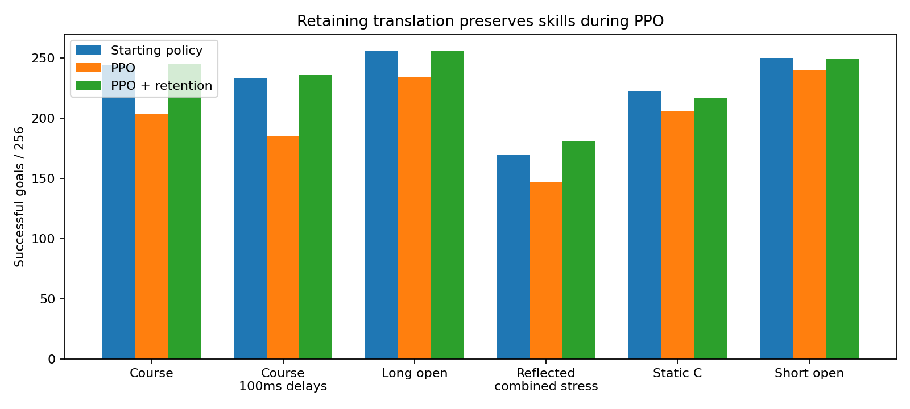
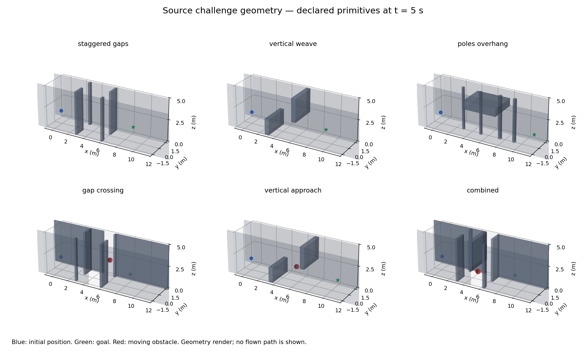
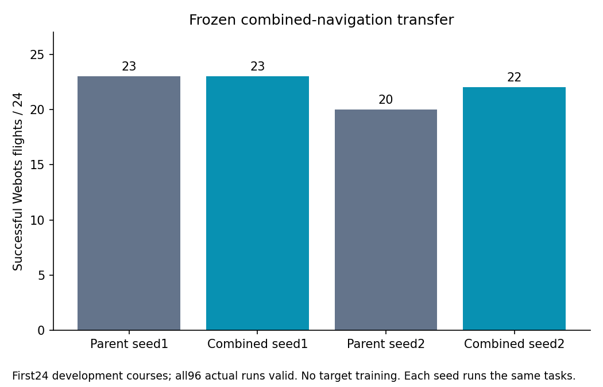
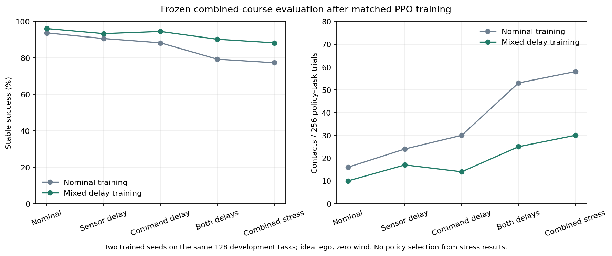

# Metal Drone Navigation

A drone should be able to reach a supplied 3-D destination through unfamiliar geometry. This project trains that navigation skill on Apple Silicon and checks frozen policies in Webots.

Depth and motion feed one navigation policy. It commands body velocity and yaw rate; RAPTOR stabilizes the aircraft and commands the motors. Semantic task understanding and destination selection belong to the upstream system.

```text
Depth / stereo + ego state + geometric goal
                    ↓
          Navigation policy at 20 Hz
                    ↓
           [vx, vy, vz, yaw_rate]
                    ↓
        Reference adapter → RAPTOR at 100 Hz
                    ↓
                  Motors
```


*The arrival policy passes an offset doorway and holds at the goal in 6.91 s without contact. [Watch the native recording](artifacts/videos/native-doorway.mp4).*

The goal is one fast, reliable navigator for static obstacles, moving threats, tight gaps and longer routes, with frozen behavior that transfers outside the training simulator. The supplied destination can be outside the current sensor view. Distance alone does not separate local navigation from semantic planning. [Full goal](goal.md).

## Latest learning result

More environments and larger networks did not by themselves produce a stronger
navigator. The [experience study](docs/EXPERIENCE_SCALE_RESULTS.md) compared equal
sample budgets at 512 and 8,192 environments. The [capacity study](docs/ACTOR_CAPACITY_RESULTS.md)
tested actors from 12,000 to nearly one million parameters. Each exposed useful
skills being lost during continued PPO.

I recovered useful translation and later turn behavior in one larger actor,
then tested a training-only physical XYZ reference loss. Four matched runs and
138 source evaluation panels are complete. Every deployed candidate remains
one navigation network; the reference teacher is removed at inference.

| Successful arrivals / 256 | Starting actor | Ordinary PPO | PPO with retention |
|---|---:|---:|---:|
| Course | 244 | 204 | **245** |
| Course, both 100 ms delays | 233 | 185 | **236** |
| Long open | 256 | 234 | **256** |
| Reflected course, combined stress | 170 | 147 | **181** |



*Two training seeds on the same 128 task instances. Retention helps both seeds,
but five static/contact/arrival gates still fail. These new actors have source
development evidence; independent transfer is pending. [All outcomes and the
754-input replay](docs/PHYSICAL_RETENTION_RESULTS.md).*

The research actor has 967,688 parameters. The default actor and earlier native
flight controls remain unchanged. [One-actor composition](docs/OUTPUT_CHANNEL_RECOVERY.md)
and [the current training experiment](docs/PHYSICAL_RETENTION_EXPERIMENT.md)
explain how useful behavior was recovered and what remains weak.

## What has improved

Training on longer goals made a large difference with the same network. Across two trained seeds, long open-room success rose from **2 to 255 of 256 trials**, and hallway success from **0 to 256**. Some earlier static skills weakened. That made retention a central part of subsequent experiments.

I added bounded moving obstacles, checked their complete paths against the scene, and allocated training transitions to several capabilities together: **50% static, 25% long goals and 25% combined courses**. Final combined policies completed **243/256 courses versus 223/256** for the static-plus-long control. Contacts fell from **33 to 13**. Free-space arrival still regressed, so these policies have not become the default.



*Generated scene geometry; the witness routes check geometry and are not learned flight paths. [Motion validation](docs/MOTION_FIDELITY.md).*

Frozen parent and combined policies then ran **96 actual Webots flights** on the same 24 course records. Combined policies completed **45/48 trials versus 43/48** for their parents; contacts fell from five to three. All flight, policy-load, stable-arrival and moving-obstacle receipts were checked. No training ran in Webots.



*Two seeds, 24 tasks per policy. These are development tasks with independent physics, sensing, motors and collisions. [Protocol and 598 hashed inputs](docs/NATIVE_COMBINED_TRANSFER.md).*

Earlier checks remain useful controls:

| Independent Webots comparison | Success | Main finding |
|---|---|---|
| Static, imitation versus fast PPO | 113/128 versus 105/128 | Fewer contacts, slower arrival: 6.17 s versus 3.61 s |
| Moving challenge, dynamic-trained versus fast PPO | 30/32 versus 13/32 | 17 paired wins, no losses; earlier linear mover paths lack the later full-path validation |
| Combined bounded courses, combined versus parent | 45/48 versus 43/48 | Modest reliability gain across both seeds; source arrival failures remain |

The [results gallery](docs/RESULTS_GALLERY.md) contains native videos, training curves, speed and reliability plots, and their source records. The [document index](docs/README.md) separates current work from earlier studies.

The latest [critic geometry comparison](docs/CRITIC_GEOMETRY_RESULTS.md) improves
course success 241→247/256 and reflected stress 175→184, but fails eight
acceptance checks. It is retained as an experiment, not the default policy.

The large actor now also flies in [native Webots](docs/WIDE_NATIVE_TRANSFER.md):
the composed and physical-retention models each reach 15/16 goals in the frozen
nominal development diagnostic, with no target training. The geometry treatment
reaches 14/16. These are actual full-stack flights through one navigation actor
and RAPTOR, using minimized batch runs.

## How learning works

The simulator advances L2F-compatible rigid-body dynamics and motor lag, renders depth, runs actual RAPTOR, and collects navigation experience. PPO, GAE, backward passes and Adam run in raw Metal. Python handles experiment orchestration and evidence review.

The default actor has **184 inputs, one 64-unit hidden layer and four outputs**, about 12,000 parameters. Current larger-policy research uses a 5,120-unit hidden layer with the same input/output contract; its FP32 actor occupies about 3.9 MB and the local CPU fixture averages 0.542 ms per forward. Microcontroller deployment still needs distillation and measurement. Its inputs include pooled current and previous depth, motion, goal context and depth-derived geometry guidance. A training critic can receive controller state that the deployed actor does not receive.

The useful imitation baseline was initialized from a trained PPO policy, then fitted to successful source flights with braking and turning behavior. It was not trained from random weights solely by imitation. Later work uses successful arrival, static, hallway and moving-course teachers to fit **one actor**, followed by PPO on the combined distribution. No teacher ID or route witness enters the deployed actor.

Early studies used 128 simultaneous environments. Current matched large-actor experiments use 512, and the experience-scale study compares 512 with 8,192. An optimized perception query workload became **8.61× faster**, with matched full-checkpoint byte parity. [Measured performance and correctness](docs/BENCHMARKS.md).

## Learning to handle delay

Matched training with clean rehearsal and both 100 ms delays improves course
success from **203 to 231/256** under both delays, and **198 to 226/256** under
combined noise, delays and plant variation. Nominal courses reach **246/256**;
long open and hallway tasks reach **256/256**. Static and short-arrival retention
still fail, so this candidate is being evaluated rather than promoted.



*Two seeds on the same 128 development tasks. [Protocol, failures and 214 hashed inputs](docs/DELAY_LEARNING.md).*

For current ownership and exact continuation steps, read [HANDOFF.md](HANDOFF.md).

## What still limits the policy

Learning a new skill can weaken an earlier one. More collision punishment reduced contacts but introduced waiting and timeouts. Parameter anchoring reduced weight drift but did not meet every speed and retention requirement. Behavior consolidation followed by PPO reaches 240/256 combined courses and 255/256 long-open goals, but still loses some static and short-arrival skill. A corrected perception-support experiment did not improve navigation and was rejected.

Astra's review identified task coverage, unequal training influence and interference between learned skills as the strongest measured problems. Network size and a replacement RL algorithm have not been shown to be the limiting factors. [Strategy and follow-up results](docs/UNIFIED_POLICY_STRATEGY.md), [combined-policy progress](docs/COMBINED_POLICY_PROGRESS.md).

The full goal remains open. Current tests establish useful simulation skills and independent development transfer. A completed 15,360-flight source diagnostic drops course success from 240/256 nominal to 191/256 under combined noise, delays and plant variation. Broad robustness, a fresh sealed evaluation and physical flight still need evidence. Live job ownership and the next runnable comparisons are in [STATUS.md](STATUS.md) and [the execution guide](docs/EXECUTION.md).

## Build and reproduce

Requires Apple Silicon, macOS, CMake and Xcode Command Line Tools. Metal compiles at runtime; full Xcode is not required.

```sh
cmake -S . -B build -DCMAKE_BUILD_TYPE=Release
cmake --build build -j 4
./build/metal_nav_guided test
```

Optional research tools have a separate build switch described in [EXECUTION.md](docs/EXECUTION.md). Preserve the exact frozen binaries for active comparisons.

```sh
python3 evidence.py --out artifacts
python3 native_combined_review.py evidence/inputs/native-combined/records.tar.gz
```

Each result report states its checkpoint, task bank, grader and evidence path. Some recent raw training records remain under local `results/`; the execution guide identifies them. Normal RL Webots runs use `--minimize --batch` and the dedicated port 23456.

Code follows [CODE_DIRECTION.md](docs/CODE_DIRECTION.md): clear domain names, explicit data flow, minimal abstraction and measured optimization. Public documents follow [WRITING_STANDARD.md](docs/WRITING_STANDARD.md).
