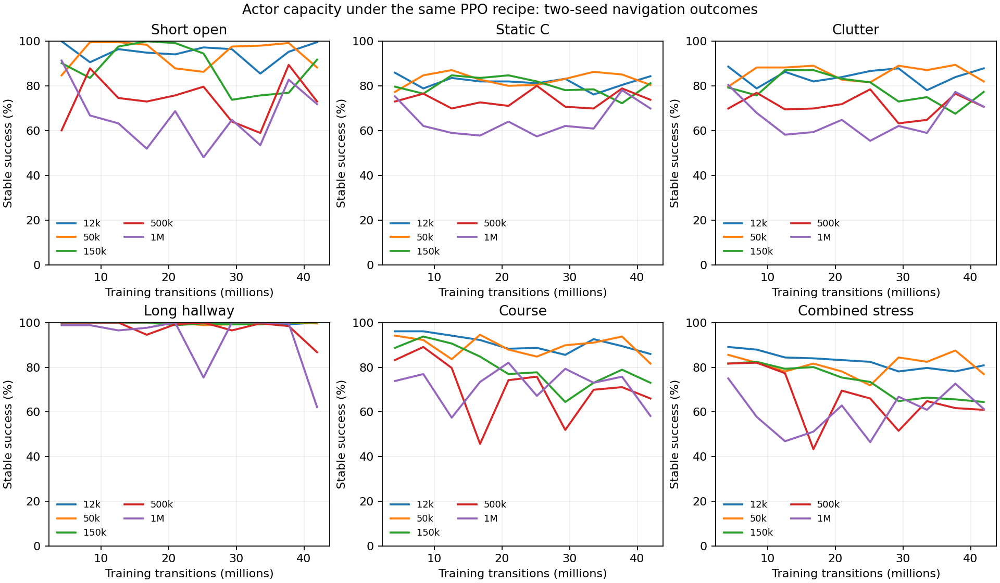

# Actor capacity under a fixed PPO recipe

Widening the actor did not produce a stronger navigator under the current PPO
recipe. Ten matched runs trained five sizes on two seeds, with 41,943,040
transitions each. The small actor retained more skills; larger actors introduced
more contacts and timeouts. No widened policy is promoted.

This is source-simulator development evidence. The corpus, critic, reward and
optimizer settings stayed fixed; this does not rule out larger policies trained
with a different update regime or broader experience.



Each point pools 256 scored flights from two seeds at the same sample budget.
The curves include all failures. Final checkpoints are the primary comparison;
earlier peaks have not become selected policies.

## What ran

The actors had 184 inputs, one hidden layer and four outputs. Hidden widths
64/256/768/2560/5120 produced 12,104/48,392/145,160/483,848/967,688 parameters.
The critic stayed at 64 inputs and 64 hidden units. All arms used 512 environments,
the same 2,048 source task payloads, PPO settings, rewards, delay rehearsal and
matching warm parents. Added neurons started with independent input weights and
zero output weights, preserving the initial actor function.

All ten saved checkpoints reached 2,560 rollouts and 327,680 Adam steps:
419,430,400 transitions in total. Matching-width evaluators completed 1,530
panels, or 195,840 scored flights. Both small-actor checkpoints match the earlier
uninterrupted N512 controls byte for byte. [Experience study](EXPERIENCE_SCALE_RESULTS.md).

## Final stable arrivals

Each cell is success out of 256 flights, pooled over the two seeds.

| Task | 12k | 50k | 150k | 500k | 1M |
|---|---:|---:|---:|---:|---:|
| Short open | 255 | 226 | 235 | 187 | 184 |
| Long open | 240 | 223 | 113 | 55 | 244 |
| Long hallway | 256 | 255 | 256 | 222 | 159 |
| Static A | 228 | 206 | 201 | 182 | 175 |
| Static B | 230 | 212 | 204 | 192 | 184 |
| Static C | 216 | 206 | 208 | 189 | 179 |
| Clutter | 225 | 210 | 198 | 181 | 181 |
| Course | 220 | 209 | 187 | 169 | 149 |
| Course, sensor delay | 223 | 209 | 178 | 163 | 157 |
| Course, command delay | 214 | 186 | 166 | 161 | 155 |
| Course, both delays | 202 | 182 | 166 | 157 | 159 |
| Course, combined stress | 207 | 197 | 165 | 156 | 157 |

The failures have different forms. The 500k actor's long-open result includes
200 timeouts, compared with 16 for the small actor. The 1M actor's hallway
result includes 97 contacts, compared with zero. On nominal courses, contacts
rise from 35 to 105. The full review retains each seed and every failure count.

Fresh seeded tasks repeat the pattern. Fresh clutter success falls from
225/256 for the small actor to 178/256 for 1M. Fresh reflected courses under
combined stress fall from 159 to 123. The 50k actor gains ten successes on one
fresh course/stress panel, but loses retention elsewhere. It is not an overall
winner. Seed variation also matters: nominal course scores for 500k are 60/128
and 109/128, compared with the small actor's 123/128 and 97/128.

## Cost and the next failure cause to test

| Actor | Measured mean training minutes per 41.94M transitions |
|---|---:|
| 12k | 3.73 |
| 50k | 5.49 |
| 150k | 10.33 |
| 500k | 26.46 |
| 1M | 93.46 |

The small-actor timing uses one complete job record; its second run was resumed
and lacks an exact first-segment wall time. Other means use both seeds. These
are shared-laptop observations. Offline grading took another 17.55 minutes.

I checked whether the wider gradient path was broken. The original parity test
had copied advantages before computing them, so its actor check mainly covered
entropy. I replaced that evidence with explicit nonzero derivatives on real
source observations and all ten trained models. Every layer matched the CPU
reference, including the added first-layer rows. The added units also changed
in training. The numerical widening path is working.

A fixed-observation probe shows that the same optimizer recipe produces different
functional update sizes. After one rollout and 128 optimizer steps:

| Actor | Mean latent Gaussian KL from its warm policy |
|---|---:|
| 12k | 0.00691 |
| 50k | 0.00714 |
| 150k | 0.00900 |
| 500k | 0.04267 |
| 1M | 0.09066 |

The 1M change is about 13 times the small actor's. This one-seed diagnostic does
not explain every lost skill, but it gives a concrete next test: control the
actor's update size while preserving the critic, task mixture and reward. We
will not dismiss larger networks from this fixed-recipe result or begin a broad
parameter sweep.

## Reproduce

The [raw evidence bundle](../evidence/inputs/actor-capacity/records.tar.gz) and
[hash manifest](../evidence/inputs/actor-capacity/manifest.json) retain grades,
receipts, headers, final inference weights, verification probes and frozen code.
Intermediate model hashes and headers are retained; rerunning intermediate
policy flights requires local snapshots or retraining. Full resume checkpoints
remain local. Inference prefixes cannot resume training or prove budgets alone.
The experimental implementation is on branch `codex/actor-capacity-sweep`,
commit `2f17eda`; the default navigator is unchanged.

Extract into an empty directory and run:

```sh
python3 navigation_capacity_results.py /path/to/extracted/results/omp-capacity-scale \
  --drift --out /tmp/actor-capacity.png
```

The review validates all ten budgets, the complete evaluation matrix and stable
arrival grades before drawing the curves. The root's corrected gradient probe
and its build commands are included in the bundle. The delegated report remains
as an experiment record; this document includes the independent root review.
