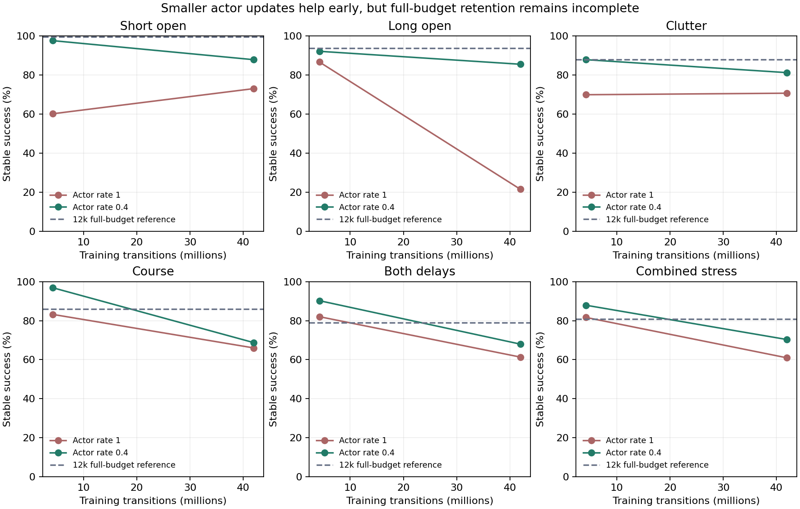

# Smaller actor updates: an early gain that did not fully hold

Reducing the 500k actor's update rate improved navigation at the same sample
budget, but did not produce a policy that retains all skills. Both full runs
finished 41,943,040 transitions and 327,680 optimizer steps. The small actor
remains the stronger overall control; no new policy is promoted.



Solid lines compare two frozen endpoints, not a densely sampled learning curve.
Each point pools 256 source flights from two seeds. The dashed line is the small
actor's full-budget result. Development tasks and failures are retained.

## The controlled change

The actor stayed at width 2560, with 483,848 parameters. Critic, task bank,
perception, physics, RAPTOR, reward and PPO settings stayed fixed. Actor Adam
rate changed from 0.0001 to 0.00004; critic rate stayed at 0.0001. The factor 0.4
was chosen from the TRAIN functional-update probe before navigation evaluation.

Default-factor checkpoint byte parity passed for both narrow and wide actors.
Nonzero trained gradients and optimizer isolation passed against the CPU. The
same-batch critic update is unchanged. Strict resume rejects a changed factor.
The one-rollout latent Gaussian KL probe fell from 0.04267 to 0.00612, an 85.7%
reduction. [Capacity study](ACTOR_CAPACITY_RESULTS.md).

## Actual navigation outcomes

Success out of 256 paired source flights:

| Task | Rate 1 pilot | Rate 0.4 pilot | Rate 1 full | Rate 0.4 full | Small actor full |
|---|---:|---:|---:|---:|---:|
| Short open | 154 | 250 | 187 | 225 | 255 |
| Long open | 222 | 236 | 55 | 219 | 240 |
| Long hallway | 256 | 256 | 222 | 256 | 256 |
| Clutter | 179 | 225 | 181 | 208 | 225 |
| Static A | 184 | 218 | 182 | 207 | 228 |
| Static B | 191 | 228 | 192 | 214 | 230 |
| Static C | 187 | 222 | 189 | 201 | 216 |
| Course | 213 | 248 | 169 | 176 | 220 |
| Course, both delays | 210 | 231 | 157 | 174 | 202 |
| Course, combined stress | 209 | 225 | 156 | 180 | 207 |

The smaller update fixes important failures in the same-size control. Full
long-open timeouts fall from 200 to 37; hallway contacts fall from 34 to zero.
Nominal course contacts fall from 87 to 79, but remain above the small actor's 35.
The early course result was much stronger: 248 successes and eight contacts.
After continued training it ends at 176 successes and 79 contacts.

This change is not uniformly better across seeds or tasks. Fresh reflected
courses under combined stress fall from 135/256 in the same-size control to
118/256 in treatment, with contacts rising from 120 to 137. The small actor
completes 159/256. On nominal courses, treatment seed one improves from 60 to
96/128 while seed two falls from 109 to 80/128. Both seeds stay in the report.

## What the result teaches

Update size was part of the problem: the treatment improves the same-size
control on most panels. It does not explain or fix the later erosion of useful
behaviors. More uniform exposure still moves the policy away from successful
routes on many held-out cases. We will investigate the objective, data influence,
value estimates, stochastic training versus mean-action evaluation and actual
failure flights before choosing another learning change.

The completed record includes two matched 4.19M pilots, both full extensions and
92 paired panels at each endpoint. Original control grades are reused; missing
fresh pilot controls were actually executed. Pilot weights and counts were
preserved before resume. Combining the pilot and extension entry counters gives
41,943,040 transitions per seed. Selected policies and default assets remain
unchanged. The broader independent-transfer goal is still active.

The [evidence bundle](../evidence/inputs/actor-step/records.tar.gz) and
[hash manifest](../evidence/inputs/actor-step/manifest.json) retain raw grades,
paired reviews, gates, commands, frozen code and inference parameter prefixes.
Full resume files remain local; bundle parameter files cannot resume training.
Extract into an empty directory and reproduce both endpoint reviews with:

```sh
python3 actor_step_results.py /path/to/extracted/results/omp-actor-step \
  --small-review /path/to/extracted/results/omp-capacity-scale/root-capacity-review.json \
  --out /tmp/actor-step.png
```

The root reviewed all paired inputs and stable arrival grades. The archive-only
review reproduces both endpoint summaries. The next diagnostic mission is
`results/omp-learning-erosion/`; it cannot alter the frozen learners or start a
coefficient sweep. This report records source development evidence, not a blind
final evaluation or a new independent simulator result.
