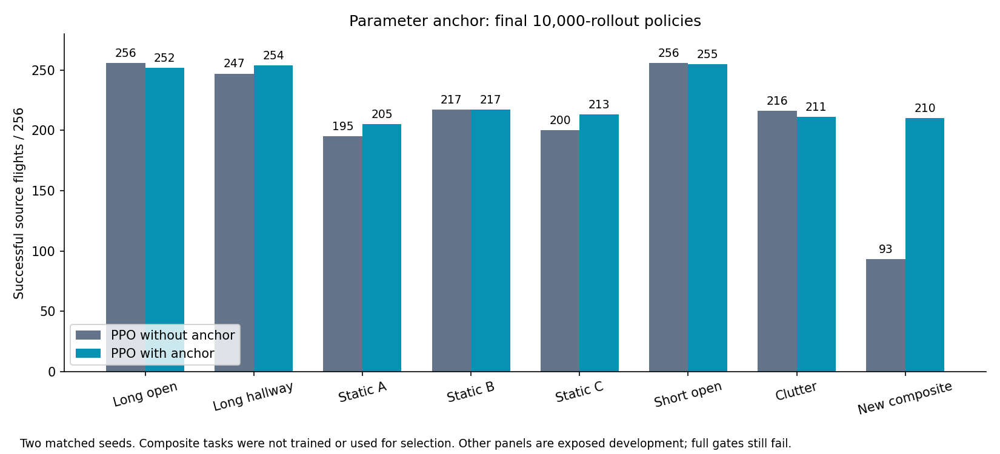

# Preserving useful behavior during PPO

Broader task coverage taught the long-route behavior, but keeping old tasks in
the bank did not preserve every old skill. I am testing the existing actor
parameter anchor before adding another training method.

Both arms use the same static-plus-long source bank, BC warmstart, 184/64/4
actor, controller-state critic, full goal distance and original observation and
action paths. Both use time cost 1, contact penalty 50 and arrival bonus 10.
The only learning intervention is an anchor coefficient of 0 versus 0.01.
The anchor adds `lambda * (weights - original_reference)` to the actor gradient
before clipping. Its radius is zero, and it includes exploration parameters.
It is a parameter penalty, not a behavioral guarantee or distillation loss.

The [runner](../navigation_critic_training.mm) now exposes `--anchor` and
`--anchor-radius`. It saves the original launch reference in the existing
hash-bound safeguard format. Resume restores that reference rather than
anchoring to the resumed policy. A coefficient mismatch or corrupt reference
is rejected before checkpoint writes.

Read-only diagnostics record PPO-gradient norm, anchor-gradient norm and the
combined norm separately. Per-slot counters record actual training transitions.
In the first control run, the four long slots account for about 59% of observed
transitions despite being one-third of the episode cycle. This is an early
execution measurement, not a final learning result.

The default path reproduced an entire 100-rollout checkpoint byte for byte.
Active anchoring produced identical full checkpoints for six uninterrupted
rollouts and three plus three resumed rollouts. The original references also
matched. Per-slot counts sum to exactly 4,096 transitions per rollout.

Four fresh matched runs use two seeds and 10,000 rollouts per arm. Final
checkpoints are primary. The same old dev-a selector is retained to keep the
anchor comparison separate from a selection change. Evaluation covers both
long panels, all five static retention panels and the new composite diagnostic.

Gates require at least 253/256 successes on each long panel and short open
flight, retention within three successes of matched control on each static
panel, and recovery to at least 223/256 on static B and 219/256 on clutter.
Contacts and timeouts must each stay within three of control, with no more
than 0.5 s added on common successful flights. Individual seed results remain
visible. The stronger static floors prevent declaring success merely because
the policy retains a weaker BC reference.

All four runs completed 10,000 rollouts / 320,000 optimizer steps and all 64
evaluations completed. The anchor reduced weight drift and preserved more
avoidance behavior, but it did not pass all gates. I kept the checkpoints as
useful candidates and did not promote them as the combined navigator.



| Source panel | Control success / contact / timeout | Anchor success / contact / timeout |
|---|---:|---:|
| Long open | 256 / 0 / 0 | 252 / 0 / 4 |
| Long hallway | 247 / 9 / 0 | 254 / 1 / 1 |
| Static A | 195 / 61 / 0 | 205 / 47 / 4 |
| Static B | 217 / 37 / 2 | 217 / 38 / 1 |
| Static C | 200 / 53 / 3 | 213 / 41 / 2 |
| Short open | 256 / 0 / 0 | 255 / 0 / 1 |
| Clutter | 216 / 36 / 4 | 211 / 39 / 6 |
| New prototype composite | 93 / 163 / 0 | 210 / 46 / 0 |

Each cell pools two independently trained policies on the same 128 task
instances. The composite bank was not trained or used for selection. Its
moving paths were later found to intersect static geometry; those results are
prototype stress evidence. The static composite subset can be examined
separately without that motion defect. Corrected moving tasks are described in
[motion fidelity](MOTION_FIDELITY.md).

The full static/long gates failed: long open missed its floor by one success,
clutter lost five versus control, the stronger B/clutter floors were missed,
and common successful arrivals were 0.78–1.35 s slower. The actor's final
reference distance averaged 1.24/1.41 across the two anchored seeds versus
9.34/9.25 without anchoring. Its restoring-gradient norm was about 0.012/0.014
versus PPO norms of 1.91/2.02. The penalty includes exploration weights, so this
comparison does not isolate mean-action anchoring.

The [247-input archive](../evidence/inputs/anchor-retention/records.tar.gz)
contains saved checkpoints, safeguards and references, all flight CSVs,
histories, diagnostics, slot exposures and launch receipts. Recompute the
[review](../evidence/inputs/anchor-retention/review.json):

```sh
python3 navigation_anchor_review.py evidence/inputs/anchor-retention/records.tar.gz
```

The next experiment reserves exact transition shares for static, long and
corrected compositional tasks. The anchor coefficient stays fixed. Source
teacher consolidation is also implemented and tested as a fallback; it has
not yet produced a claimed capability gain.
