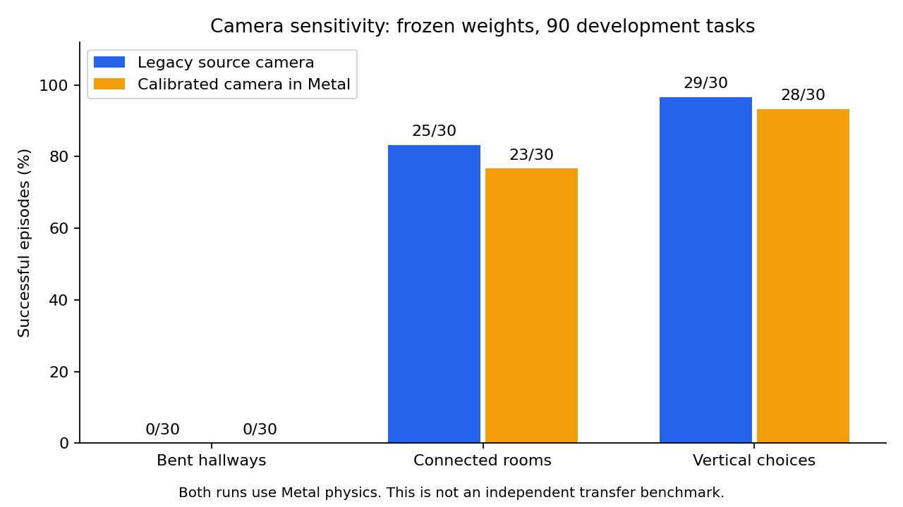

# Calibrated camera profile

The default camera and selected policy stay unchanged. An optional profile now models the
measured Webots R2025a RangeFinder projection and sensor mount. This corrects a simulator
input contract; it does not establish general navigation or hardware fidelity.

| Contract | Legacy default | Calibrated option |
|---|---|---|
| Horizontal half-tangent | 1.0 | 1.0 |
| Vertical half-tangent | 0.75 | 0.8 |
| Camera origin | Body origin | 0.08 m forward in body X |
| Internal depth | Ray range | Ray range, converted from native axial depth on deployment |
| Full resume | Existing versions 3–9 | Version 10 with camera contract |

The native sensor reports axial depth. The existing legacy adapter resamples its rows onto
0.75 and converts depth to range. That approximation can select another surface at an edge.
The optional profile uses the measured projection directly. Both profiles share
[sensor_profile.hpp](../sensor_profile.hpp) across CPU, Metal, guidance, export and the native
controller. [world.hpp](../world.hpp) remains byte-identical, preserving existing bank records.

## Evidence and limits

The published [fixture](../evidence/inputs/sensor-profile/native-frames.jsonl) contains 14
real native captures and 4,480 finite pixels from a static geometry rig. Against the declared
geometry, calibrated ray-range residual is 0.292 mm median, 1.628 mm at the 95th percentile,
and 6.063 mm maximum. These poses do not test range clipping, flight noise or sensor motion.
[Pixel analysis](../evidence/inputs/sensor-profile/pixel-analysis.json) preserves each limit.

Root review found an optimized memory kernel still projecting native history points with
literal 0.75. It now uses the active profile. A four-frame geometry test compares the actual
GPU point cache and candidate clearances to the direct CPU reference. Native maximum errors
are 1.91e-6 m for points and 5.72e-6 m for clearance. The legacy path also passes, and all
90 legacy development records reproduce the prior strong-control records exactly.

The corrected native profile changes the input distribution of the frozen rooms policy:

| Profile in Metal | Hallways | Rooms | Vertical | Total |
|---|---|---|---|---|
| Legacy | 0/30 | 25/30 | 29/30 | 54/90 |
| Calibrated, cache corrected | 0/30 | 23/30 | 28/30 | 51/90 |



These are development results from the same Metal physics and weights, with 20 s budgets,
1.5 m/s command caps and the original contact grading. They are not independent transfer
or new learning. The earlier 48/90 prototype used the inconsistent point cache and remains
in the local experiment archive. It is superseded as a coherent camera-profile result.
The preserved independent room benchmark remains 18/30 Webots versus 25/30 Metal.
No policy or default asset is adopted from this change.

Full native checkpoint resumes now require the embedded camera contract. Both native and
legacy roundtrips pass; cross-profile resumes fail. Explicit parameter-only warmstarts and
camera sensitivity evaluations are still allowed. A calibrated deployed raw-depth asset
uses NAVCAL3 and an explicit 32-byte sensor declaration. The reader rejects a wrong format
version, camera declaration or nonzero reserved field. That declaration describes required
inputs; it alone does not prove the weights were trained with those inputs.

Original FINAL records were preserved and not policy-evaluated. Earlier research exposed
aggregate FINAL geometry; future blind evidence therefore requires a fresh sealed suite
after weights and navigation logic are frozen.

## Reproduce

On a Metal-capable Mac, from the repository root:

```sh
cmake -S . -B build
cmake --build build --target metal_nav_guided metal_nav_guided_native -j2
build/metal_nav_guided sensor-profile-check results/legacy-rays.csv
build/metal_nav_guided_native sensor-profile-check results/native-rays.csv
python3 webots/sensor_profile_fixture.py evidence/inputs/sensor-profile/native-frames.jsonl results/native-rays.csv results/pixel-analysis.json
build/metal_nav_guided bank-eval assets/checkpoints/rooms-focused-experimental.bin.best evidence/inputs/challenge-bank-mirrored-v1.jsonl dev results/legacy-camera-dev.csv 17 1.5 400
build/metal_nav_guided_native bank-eval assets/checkpoints/rooms-focused-experimental.bin.best evidence/inputs/challenge-bank-mirrored-v1.jsonl dev results/native-camera-dev.csv 17 1.5 400
python3 sensor_profile_results.py
```

Create `results/` first if absent. The plot uses published episode records; the bank commands
produce fresh records. The native fixture world and controller are under
`webots/worlds/sensor-geometry-audit.wbt` and `webots/controllers/sensor_geometry_audit/`.
Use an isolated RL Webots process and port 23456. [Sensor audit](SENSOR_GEOMETRY_AUDIT.md)
describes the original native capture and adapter assumptions.

[Proof and hashes](../evidence/inputs/sensor-profile/proof.json) bind the source, checkpoint,
bank, records and checks. Closed-loop task learning and independent transfer remain separate
requirements of [the active goal](../goal.md).
