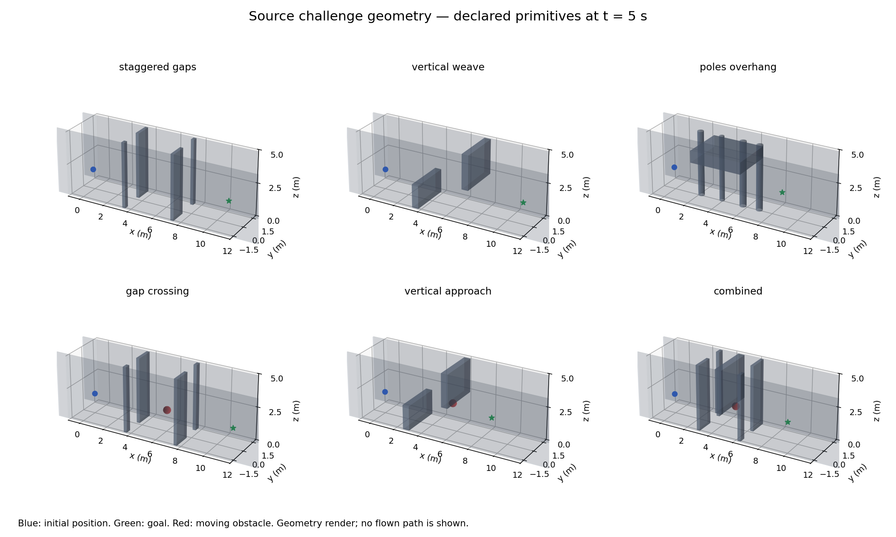

# Combining navigation skills within a flight

The first bank below is preserved as a prototype. A later audit found that all
384 moving TRAIN records pass through other geometry or the room boundary
during the 20 s task window. Its drone-path witnesses did not check the movers'
own clearance. I stopped the unfinished training comparison and replaced those
paths with [bounded motion and side openings](MOTION_FIDELITY.md). The original
scores remain evidence of responses to those synthetic encounters, not faithful
moving-course navigation. The static records are unaffected.

The new source bank combines geometry and moving threats instead of giving each
skill its own simple episode. It has 768 TRAIN records and 128 separate
development records, with six capability groups:

- Staggered, offset gaps along a longer corridor.
- Floor obstructions followed by hanging obstructions, requiring over/under choices.
- Poles with an overhead obstruction.
- Offset gaps followed by a crossing obstacle.
- Vertical choices with an approaching obstacle.
- Offset gaps, a low passage and a crossing obstacle in the same route.

Routes span 8.5–11.5 m. Gap widths vary from 0.85 to 1.55 m, while starts vary
in height, yaw and velocity. Moving spheres cross or approach at 0.35–1 m/s.
The world retains the simulator's 0.18 m collision radius, box half-extents,
sphere radii, capped-cylinder geometry and linear obstacle motion.



*The declared world primitives at five seconds. Blue marks the initial position,
green the destination, and red a moving obstacle. This is a geometry rendering;
it does not depict a flown path or a Webots recording.*

The [generator](../navigation_challenge_tasks.py) checks candidate paths through
the [shared collision implementation](../navigation_geometry_check.cpp), using
world.hpp directly. It samples space and time, then subtracts a Lipschitz bound
for the intervals between samples. Moving cases include a declared 2.5 s
initial wait in their geometric witness. This proves a scheduled clear path,
not that RAPTOR can track it from every sampled start. The witness remains
offline metadata; the actor receives its normal depth, ego state and goal.

The cumulative TRAIN bank preserves all 1,536 static/long rehearsal records
byte for byte and adds six challenge slots per environment: 2,304 records
in an 18-slot cycle. The new bank is built but has not yet been used for
training. Noise, delay and dynamics variation are separate axes, initially
nominal here.

Frozen source probes ran all 128 development tasks through the actual existing
Metal/RAPTOR loop. No weights changed during these flights:

| Capability | Tasks | BC success | Fast PPO | Moving specialist | Long candidate seed 2 |
|---|---:|---:|---:|---:|---:|
| Staggered gaps | 22 | 13 | 3 | 5 | 17 |
| Vertical weave | 22 | 22 | 4 | 8 | 19 |
| Poles and overhang | 21 | 21 | 3 | 7 | 5 |
| Gaps and crossing threat | 21 | 12 | 2 | 7 | 13 |
| Vertical route and approaching threat | 21 | 19 | 2 | 7 | 19 |
| Combined gaps, low passage and crossing | 21 | 10 | 0 | 4 | 9 |
| **Total** | **128** | **97** | **14** | **38** | **82** |

These probes reveal complementary skills. The long candidate improves offset
gap traversal but loses the BC baseline's pole avoidance. Every failure in this
probe was retained; fast PPO also had nine timeouts. These source development
results do not establish transfer or a single policy with all capabilities.

The [evidence archive](../evidence/inputs/composite-challenges/records.tar.gz)
contains 19 hashed inputs: TRAIN/development banks and manifests, all 512
probe flights, invocation receipts, logs and generator/geometry source.

The next controlled retention study keeps its earlier static-plus-long bank
fixed while testing a policy anchor. This new compositional bank is an
additional frozen diagnostic there. Once the retention mechanism is assessed,
the cumulative bank can train and test the combined capability directly.

```sh
clang++ -std=c++17 -O3 navigation_geometry_check.cpp -o build/navigation_geometry_check
python3 navigation_challenge_tasks.py results/composite-train \
  --checker build/navigation_geometry_check --seed 20261131 --period 6 \
  --rehearsal STATIC_PLUS_LONG_BANK.bin
python3 navigation_challenge_tasks.py results/composite-dev \
  --checker build/navigation_geometry_check --seed 20261130
```
