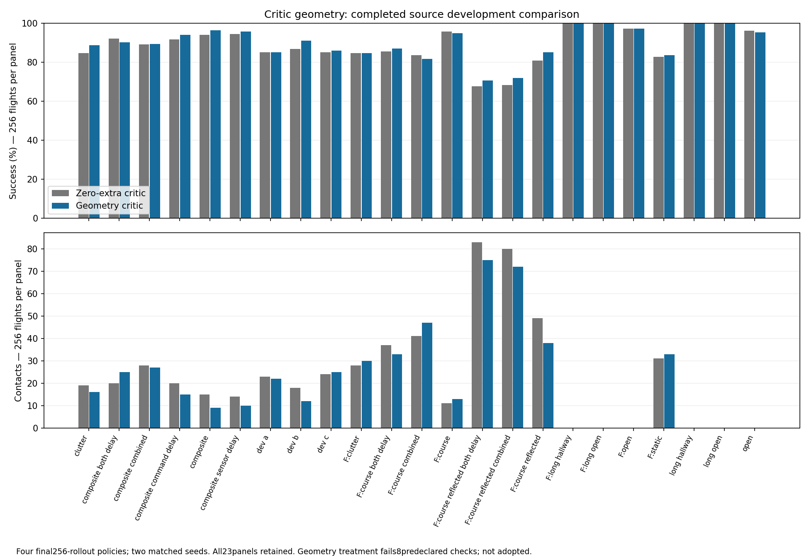

# Critic geometry results

More complete critic geometry helped several navigation panels, but did not
meet the frozen acceptance gates. The treatment is **not adopted**.

All four runs completed 256 rollouts, 4.194 million transitions and 32,768 Adam
updates each. All 92 evaluations completed: 11,776 scored source flights.
Both critics had 226 inputs and 64 hidden units. The actor, source tasks, reward,
physical teacher and training budget were held fixed. See the
[experiment and verification](CRITIC_GEOMETRY_EXPERIMENT.md).

| Final source panel — two seeds, 256 flights | Zero-extra critic | Geometry critic |
|---|---:|---:|
| Static C success / contact / timeout | 218 / 24 / 14 | 220 / 25 / 11 |
| Course | 241 / 15 / 0 | 247 / 9 / 0 |
| Old open | 246 / 0 / 10 | 244 / 0 / 12 |
| Fresh open | 249 / 0 / 7 | 249 / 0 / 7 |
| Long open | 256 / 0 / 0 | 256 / 0 / 0 |
| Reflected combined stress | 175 / 80 / 1 | 184 / 72 / 0 |

Course gains occur in both seeds: 121→124 and 120→123. On common successful
course flights, the geometry actor arrives 0.145 s sooner. Its reflected-stress
gain is also useful. Those gains do not compensate for the failed criteria:

- Static C gains two successes rather than the required four, and adds one
  contact rather than removing three.
- The both-delay course loses five successes and adds five contacts.
- The fresh combined course loses five successes and adds six contacts.
- Old and fresh open results remain below the 253/256 arrival floor.

These are eight failed checks, not eight independent failure mechanisms.
The [independent grader](../navigation_critic_geometry_results.py) retains every
panel and pairs source records by scene, start, yaw and goal. Cached parent and
prior unmasked results are checked and reused rather than flown again.



Training wall times were 608, 648, 953 and 608 seconds in execution order;
evaluation took 149 seconds. The variation does not support a pure hardware
throughput claim. Nominal critic parameter count was matched, but the control's
extra input weights remain inactive. This comparison measures the geometry
addition under the fixed recipe, not an information or capacity ceiling.

## What this changes

The audit's missing-geometry hypothesis produced a measurable but limited
navigation effect. It did not solve arrival stalling or all delay failures.
No feature sweep or longer extension follows from these results. The stronger
prior unmasked candidate and all new controls remain available.

The next diagnosis must use the actual failed flights and requested versus
executed motion before changing training again. New independent checks of these
large actors are reported in [wide-policy Webots transfer](WIDE_NATIVE_TRANSFER.md).

## Reproduce

```sh
python3 navigation_critic_geometry_results.py \
  --archive evidence/inputs/critic-geometry/records.parts.json
```

The archive contains 595 hashed inputs, including all four full final checkpoints,
source, actual exposure counters, all scored comparisons and failed checks.
Archive-only grading matches the live result exactly.

The raw archive is split into checksum-bound parts for reliable Git upload.
The replay joins them losslessly; original data and results are unchanged.
