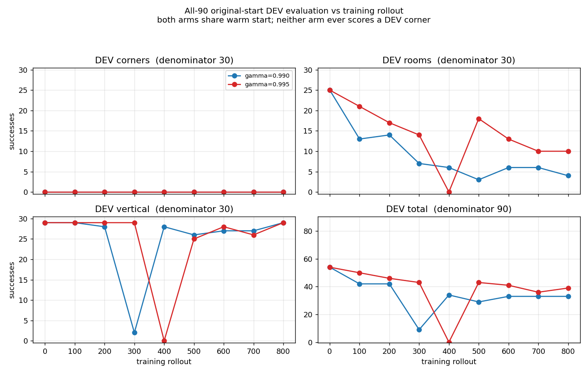
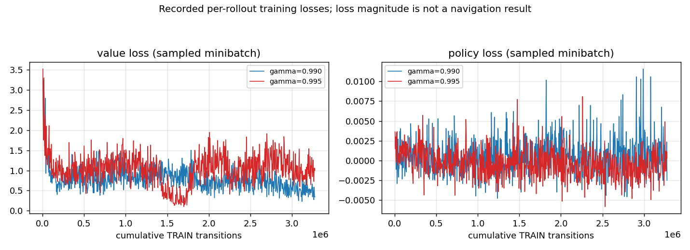
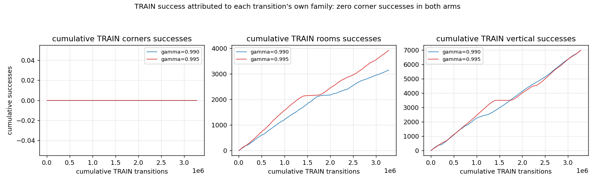

# Longer reward horizon: controlled PPO result

Raising the discount from `.99` to `.995` did not produce corner navigation in
this run. Neither arm completed a TRAIN corner episode or a DEV corner task.
Both lost room retention. The selected policies remain unchanged.

The [reward audit](RESEARCH_CREDIT_ASSIGNMENT.md) found that two successful
teacher flights scored below matched finite-budget hovering. Reweighting the
same flights with `.995` removed that inversion. We then tested whether the
longer reward horizon would improve actual PPO learning.

## Protocol

Each cold arm used the same raw824 parameter warm start, seed42, uniform TRAIN
bank sampler, original starts,128 environments,32-tick rollouts,2 epochs and
256-row minibatches. Learning rate was `.0001`, entropy coefficient `.0005`,
risk coefficient `.1`, GAE lambda `.95`, velocity cap1.5m/s and flight limit20s.
Shaping, direction supervision and retention anchors were disabled. Only gamma
changed. Each arm ran800 rollouts:3,276,800 transitions.

The sampler rules and RNG matched. Actual environment-to-world assignments
diverged after policies produced different episode lengths. Per-rollout
schedule hashes preserve that difference; these were matched procedures,
not identical trajectories.

All90 original-start DEV cases were evaluated before training and every100
rollouts. Each evaluated checkpoint was retained. These are development
results, not blind final evaluation.

| Outcome | Gamma.99 | Gamma.995 |
|---|---:|---:|
| TRAIN corner successes / episodes | 0 /29,791 | 0 /30,387 |
| Final DEV corners /30 | 0 | 0 |
| Final DEV rooms /30 | 4 | 10 |
| Final DEV vertical tasks /30 | 29 | 29 |
| Final DEV total /90 | 33 | 39 |

The shared baseline was54/90:0 corners,25 rooms,29 vertical tasks. The `.995`
arm briefly fell to0/90 at rollout400. No checkpoint met the corner-gain and
25-room/29-vertical retention gate.







Every point comes from the recorded tables. Loss values are sampled training
minibatch metrics. They are not a navigation validation measure. Episode family
comes from the transition's pre-reset bank ID and was checked against total
environment counters.

## Interpretation

This experiment gives no evidence that this discount change solves the current
corner failure. It does not prove that reward design or credit assignment is
irrelevant. No positive corner flight occurred during either arm, so a larger
delayed bonus had no demonstrated successful behavior to reinforce.

The next work addresses task visibility, source supervision, local waypoint
control and sensor-built route discovery. Numerical PPO correctness and more
rollouts do not establish those capabilities.

## Evidence and reproduction

The [proof manifest](../evidence/inputs/discount-experiment/proof.json) contains
settings, source/binary/input hashes, stage results and final counts. Root
verified all18 checkpoint/evaluation hashes and every90-case evaluation count.
The four compact CSV tables preserve all1600 training rows and18 evaluation
stages. Full rejected checkpoints remain in the local experiment directory.

Rebuild figures without simulation:

```sh
python3 discount_experiment.py
```

Build the cold runner:

```sh
clang++ -std=c++17 -O3 -fobjc-arc \
  -DSOURCE_DIR=\"$(pwd)\" -DFIXED_PPO_ACTOR_OBS_DIM=824 \
  navigation_credit.mm -framework Foundation -framework Metal \
  -framework Accelerate -o build/credit
```

Create the raw824 parameter warm start with the public `metal_nav_raw_guided`
binary's `lift-guided` command and
`assets/checkpoints/rooms-focused-experimental.bin.best`. Use separate output
directories per cold arm. While holding an exclusive `fcntl.flock` on
`results/metal-training.lock`, run:

```sh
build/credit --train evidence/inputs/challenge-bank-mirrored-v1.jsonl \
  RAW824_WARMSTART OUTPUT_DIR gamma0990 800 100
build/credit --train evidence/inputs/challenge-bank-mirrored-v1.jsonl \
  RAW824_WARMSTART SECOND_OUTPUT_DIR gamma0995 800 100
```

Gamma is recorded in experimental provenance; this runner rejects full resume
because the legacy checkpoint format does not encode gamma. Its selected
warm-start parameters are not an optimizer resume.

No target-side training or policy FINAL evaluation occurred. A later research
audit exposed aggregate geometry from the original FINAL split. The records
remain unchanged, but future blind proof must use a fresh sealed suite generated
after the policy and navigation logic freeze. That disclosure does not change
the TRAIN/DEV results reported here.
