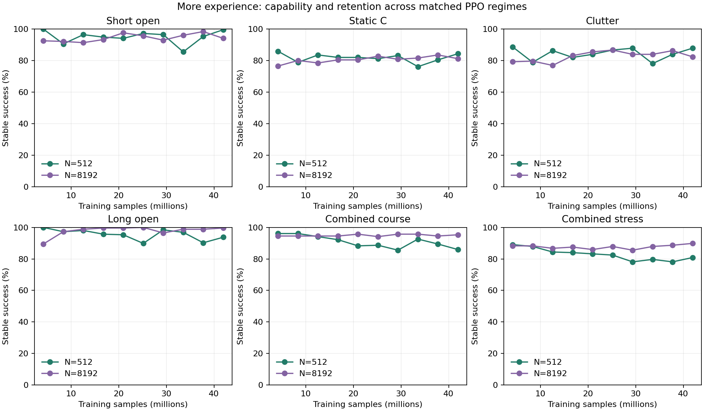

# More PPO experience: stronger skills, uneven retention

Four PPO runs added 167,772,160 training transitions. Each of two warm policies
trained with either 512 or 8,192 parallel environments, for 41,943,040 transitions
and 327,680 optimizer steps. The smaller batches improved short and static
navigation. The larger batches better retained long routes and obstacle courses.
Neither produced a uniformly stronger navigator.



Each point pools 256 flights from two seeds. These are stable goal arrivals,
not reward or training loss. Earlier peaks are diagnostic; final checkpoints
are the primary comparison. The course stress panel combines sensing, command
delay and dynamics variation in the existing source simulator.

## What changed

The actor stayed at 184 inputs, 64 hidden units and four outputs. Both regimes
used the same 64-input critic, PPO settings, rewards, two matched warm starts,
2,048 unique task payloads and clean/delayed rehearsal. Task lanes allocated
50% of transitions to static tasks, 25% to long routes and 25% to courses.

Environment count changes the PPO collection regime as well as throughput.
At the same sample budget, N512 performs 2,560 collection/update cycles and
N8192 performs 160. Batch normalization and the number of updates before fresh
experience also differ. This comparison does not isolate hardware parallelism.

Every run visited all 2,048 task payloads. Exact entry counters confirm the lane
shares and 50/50 clean/delayed exposure. The most frequent payload received
less than 0.2% of transitions. This rules out unvisited levels as the whole
explanation; it does not prove equal learning influence or sufficient diversity.

## Final results on the existing development portfolio

| Stable success / 256 | N512 | N8192 |
|---|---:|---:|
| Short open | 255 | 241 |
| Static A | 228 | 208 |
| Static B | 230 | 223 |
| Static C | 216 | 208 |
| Clutter | 225 | 211 |
| Long open | 240 | 255 |
| Long hallway | 256 | 256 |
| Course | 220 | 244 |
| Course, sensor delay | 223 | 235 |
| Course, command delay | 214 | 234 |
| Course, both delays | 202 | 228 |
| Course, combined stress | 207 | 230 |

All 480 evaluation panels completed, covering 61,440 scored flights across ten
sample checkpoints. N512's final course score hides a seed difference: 123/128
and 97/128. N8192 ends at 119/128 and 125/128. Both seeds remain in every pooled
result. The full reviewer retains contacts, timeouts and successful arrival time.

Recorded training wall times were 486/225 seconds for N512 and 185/185 seconds
for N8192. Offline grading took another 648 seconds. Laptop contention and
thermal state affect these observations; the earlier pilot measured a different
wall-time ranking. [Pilot results](PARALLELISM_PILOT.md).

## Fresh tasks after checkpoint freeze

I generated seven new seeded banks: static obstacles, clutter, short open,
long open, long hallway, courses and reflected courses. Starts in the first
three banks have independent small velocities. The course routes span 6–12.5 m.
Six frozen policies—two warm parents and four final scale policies—ran 90 panels,
or 11,520 flights. None of these task payloads entered training or sampler state.
These are fresh source development tasks from existing procedural families.

| Stable success / 256 | Warm parents | N512 | N8192 |
|---|---:|---:|---:|
| Static | 201 | 218 | 206 |
| Clutter | 205 | 225 | 211 |
| Short open | 228 | 255 | 244 |
| Long open | 256 | 247 | 256 |
| Long hallway | 256 | 256 | 254 |
| Course | 241 | 225 | 241 |
| Course, both delays | 215 | 200 | 217 |
| Course, combined stress | 209 | 191 | 218 |
| Reflected course | 210 | 192 | 205 |
| Reflected course, both delays | 169 | 163 | 175 |
| Reflected course, combined stress | 172 | 159 | 184 |

The fresh results repeat the retention tradeoff. They also expose a harder
reflected course distribution, especially with delay. More uniform experience
helps some skills but does not combine them reliably. The next controlled change
is TRAIN-outcome-based sampling within the same capability lanes, with broad
uniform support. Reward, model capacity and task corpus stay fixed for that test.

## Reproduce the review

The public [evidence bundle](../evidence/inputs/experience-scale/records.tar.gz)
and [hash manifest](../evidence/inputs/experience-scale/manifest.json) retain
raw grades, process receipts, checkpoint headers, inference-only model prefixes,
entry exposure counts, source contracts and frozen code. Full resume checkpoints
remain local; their original hashes are retained. Model prefixes cannot resume
training or independently prove the total sample budget.

Extract the bundle into an empty directory, then run the reviewer from this repo:

```sh
python3 navigation_scaling_results.py /path/to/extracted/results/training-scale/long \
  --fresh /path/to/extracted/results/training-scale/heldout-evals-v1 \
  --out /tmp/experience-scale.png
```

`navigation_scale_holdout.py` regenerates the fresh banks from the frozen bank
builder and geometry checker. `navigation_scale_evaluate.py` freezes policy,
bank and runtime shader hashes before evaluation. Geometric course witnesses
establish path clearance; the actual policy flights establish navigation outcomes.
