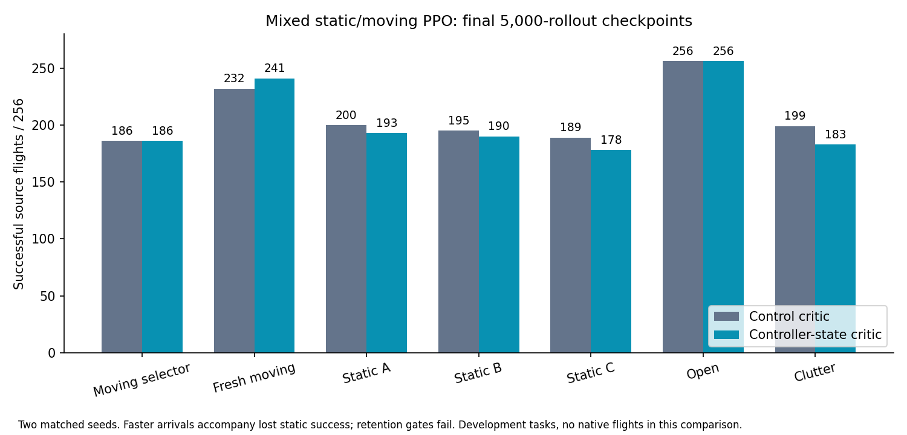

# One value function for static and moving tasks

The moving-obstacle policy transfers well to the native challenge, but it also
lost some static-task performance. I am testing the controller-state critic
in the original mixed trainer rather than adding another navigation specialist.

That trainer cycles four dynamic tasks and eight static tasks per environment.
Its 512 dynamic records and 1,024 static records remain unchanged. The static
bank is byte-identical to the canonical source bank. Episode proportions are
one-third dynamic and two-thirds static; transition proportions depend on
actual flight duration and are recorded by the trainer.

Both arms keep the original 184-input actor, FULL depth history, body action
mapping, legacy camera, physics and reward. They use the original time cost
0.2 per second, contact penalty 10 and arrival bonus 10. Both critics have
64 inputs and 64 hidden units; only controller-state information differs.
The control's extra inputs are zero. Both use the same fast warmstart and the
same zero-padded migration of its 32-input value weights.

The new [wrapper](../navigation_joint_critic.mm) uses the tested root critic
core. The old dynamic module and snapshot remain preserved. A one-rollout
smoke passed reset position, reference, goal, yaw and episode-clock checks,
then saved one rollout and 32 optimizer steps with 12,104 actor parameters
and 4,225 critic parameters.

Four fresh 5,000-rollout runs compare control/treatment across the original
two seeds. Final checkpoints are primary and source dev-dyn selects checkpoints.
The evaluation includes fresh dev-dyn2 and all static retention banks. Gates
require retaining dynamic success, improving static blocked routes, reaching
at least 254/256 open goals, and preserving speed. They were fixed before the
full runs. No simulator-side policy training or asset replacement is implied.

All four runs completed 5,000 rollouts and 160,000 optimizer steps. All 56
evaluations completed. The richer critic improved fresh moving-task success,
but the joint policy lost static avoidance skill. I did not adopt it.



Each count pools two matched seeds, 256 source flights per arm. Final
checkpoints are primary; these are development evaluations.

| Tasks | Control success / contact / timeout | Rich critic success / contact / timeout |
|---|---:|---:|
| Moving selector | 186 / 70 / 0 | 186 / 70 / 0 |
| Fresh moving | 232 / 24 / 0 | 241 / 15 / 0 |
| Static A | 200 / 54 / 2 | 193 / 63 / 0 |
| Static B | 195 / 61 / 0 | 190 / 66 / 0 |
| Static C | 189 / 67 / 0 | 178 / 78 / 0 |
| Open | 256 / 0 / 0 | 256 / 0 / 0 |
| Clutter | 199 / 56 / 1 | 183 / 73 / 0 |

The blocked static subset fell from 156 to 114 successes. Successful arrivals
were faster on every panel, but that speed came with more static contacts.
Static retention and blocked-route improvement gates failed. Source-selected
best checkpoints also lost fresh moving success (237 to 232) and did not
rescue the combined capability.

The same value inputs helped the earlier high-contact-penalty static experiment.
They did not solve retention in this mixed trainer with its original reward.
This result supports preserving broad behavioral checks when changing the
critic; a better moving score alone cannot select a general navigator.

The [archive](../evidence/inputs/joint-critic/records.tar.gz) contains 175 hashed
inputs, including all flight CSVs, saved checkpoints, training histories,
diagnostics, job receipts, frozen banks and source. The
[review](../evidence/inputs/joint-critic/review.json) is reproducible:

```sh
python3 joint_critic_review.py evidence/inputs/joint-critic/records.tar.gz
```
