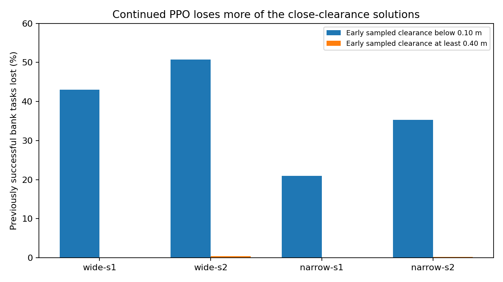

# Why more PPO has not kept the early gains

The larger policy can navigate well early in training, then lose useful behavior.
The width-2560 policy with the smaller actor step reaches 248 of 256 nominal
course goals after 4.19 million samples, but reaches 176 after 41.94 million.
The [actor-step study](ACTOR_STEP_RESULTS.md) preserves those runs and the broad
retention results. Neither policy was promoted.

I checked whether this is only a development-set problem. On all 2,048 unique
TRAIN payloads, the two wide policies together fall from 3,688 to 3,175 successful
greedy nominal flights out of 4,096. Contacts increase from 299 to 688. More
experience is erasing skills even on familiar geometry. That evaluation weights
unique payloads equally; the actual learner allocates 50% of transitions to
static tasks, 25% to long tasks and 25% to courses.

The first diagnostic blamed a short GAE horizon. Its setup differed from the
learner: deterministic actions, no delay and 400-step estimates instead of
stochastic actions, mixed delays and 32-step windows. I rejected that causal
conclusion and requested a corrected collection.

The corrected diagnostic runs the actual stochastic action map through RAPTOR
for twelve continuous 32-step windows, with 512 environments and the source bank.
It checks early and full wide and narrow policies on both seeds. The actors stay
frozen between windows. Root independently replayed all 96 windows from their
rewards, values and termination masks. Maximum GAE error is 0.000018; normalized
advantage error is 0.00011. Bootstrap carries future value across a window, so
there is no hard 0.84-second credit cutoff. No lambda experiment follows from
the earlier claim.



The chart measures the fraction of early successful bank tasks that the later
policy loses. Across the four pairs, losses cluster around small clearance.
Only 3 of 2,332 successful tasks with sampled clearance of at least 0.40 m are
lost. This is an association worth investigating, not an explanation of which
optimizer updates erase avoidance.

Clearance here is measured outside the 0.18 m collision sphere before each action;
it excludes the following five physics substeps. Episodes match bank payloads,
but different flight lengths change subsequent random draws. The diagnostic's
raw action columns are Gaussian samples, before guidance, tanh, delay and RAPTOR.
A larger raw action norm does not directly mean a larger physical velocity.

I have not accepted the proposed stronger parameter anchor. It pulls toward the
original warmstart, rather than the useful early trained policy. The earlier
[anchor comparison](ANCHOR_RETENTION_EXPERIMENT.md) reduced weight drift but did
not keep all skills and slowed arrival. The next diagnostic inspects actual
bounded updates from cloned saved learner states: functional step size,
clipping, anchor and Adam effects, and gradients from different task classes.
A learning change must follow an observed mechanism and its retention costs.

The [retained inputs](../evidence/inputs/learning-erosion/records.tar.gz) contain
lossless numeric replay columns from all eight real runs, original CSV hashes,
run receipts and diagnostic source. They support GAE, normalization and the
sampled-clearance plot; they do not contain every actor observation or full
checkpoint state. Recompute the checked results and chart:

```sh
python3 navigation_erosion_window_review.py \
  evidence/inputs/learning-erosion/records.tar.gz \
  --output evidence/inputs/learning-erosion/review.json \
  --plot artifacts/plots/learning-erosion.png
```

This resolves an incorrect diagnosis. It does not resolve the original navigation
goal. The selected policy and default assets remain unchanged.
