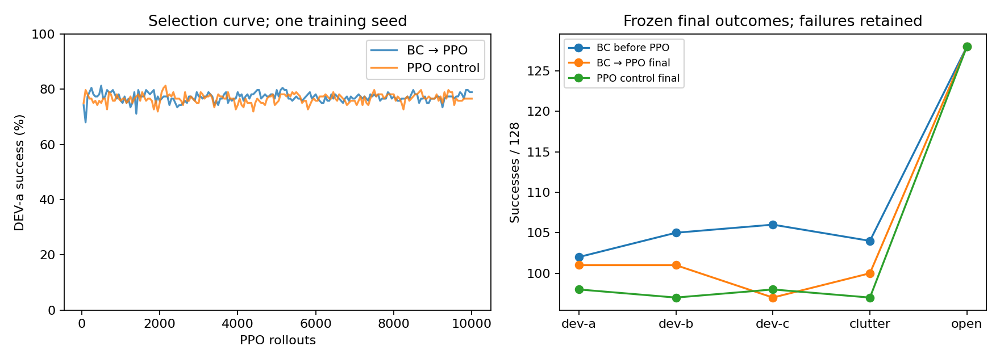
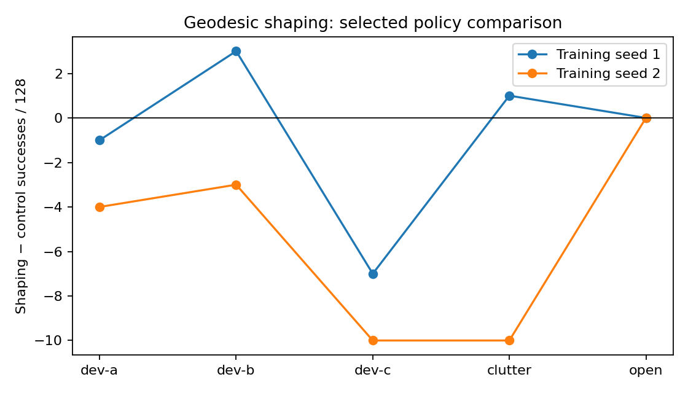
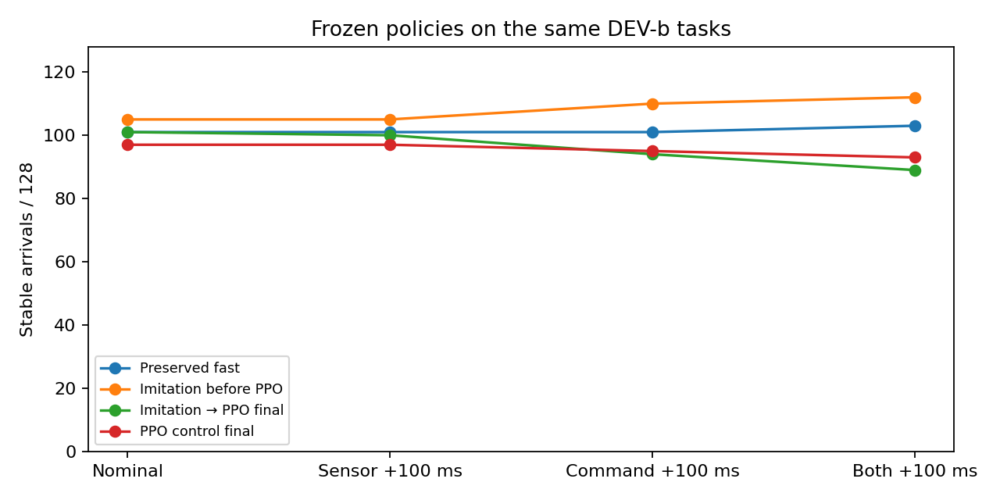

# What the latest local training experiments show

The current policy still fails too often on local detours. More PPO updates
did not produce a large, consistent gain. The goal remains incomplete.
This review uses actual flight rows, with all contacts and timeouts retained.
It does not change a deployed policy or simulator default.

## Observe before moving: BC followed by PPO

The teacher brakes and turns toward the supplied goal, then follows the prior
experimental policy. It flew the real source RAPTOR plant on all 1,024 TRAIN
tasks. Successful demonstrations warmstarted one PPO arm. The control starts
from the same previous policy without imitation. Both arms completed exactly
10,000 PPO rollouts on the same bank and recipe. Final weights are the primary
comparison; best DEV-a checkpoints are secondary.

| Development bank | BC before PPO | BC → PPO final | PPO control final | Paired net gain |
|---|---:|---:|---:|---:|
| DEV-a, selection | 102/128 | 101/128 | 98/128 | +3 |
| DEV-b | 105/128 | 101/128 | 97/128 | +4 |
| DEV-c | 106/128 | 97/128 | 98/128 | −1 |
| Clutter | 104/128 | 100/128 | 97/128 | +3 |
| Open | 128/128 | 128/128 | 128/128 | 0 |

BC took 5.43 s on successful DEV-c flights; after PPO this fell to 2.85 s,
but successes fell from 106 to 97. That is a speed/reliability tradeoff,
not a clear improvement. The final DEV-a gain missed the declared +4 gate
for a second training seed. This comparison has one training seed.
The seed gate was recorded after the treatment's final result was known and
before the control result was read; it was not registered before both arms.



## Geodesic reward shaping

One fixed potential-shaping recipe was tested against PPO without shaping,
using two training seeds and the existing local bank. It failed the declared
improvement criterion. These tables compare policies selected on DEV-a.

| Development bank | Control seed 1 | Shaped seed 1 | Control seed 2 | Shaped seed 2 |
|---|---:|---:|---:|---:|
| DEV-a | 103/128 | 102/128 | 105/128 | 101/128 |
| DEV-b | 101/128 | 104/128 | 103/128 | 100/128 |
| DEV-c | 99/128 | 92/128 | 102/128 | 92/128 |
| Clutter | 98/128 | 99/128 | 104/128 | 94/128 |
| Open | 128/128 | 128/128 | 128/128 | 128/128 |

Seed 1's shaped job ran to 3,700 after an incorrect incremental resume.
Its selected best checkpoint was saved at 1,950, within the declared 2,000
selection budget. The extra compute is disclosed; no final-2,000 shaped
checkpoint is claimed. Seed 2 ran exactly 2,000 for both arms.
This rejects the tested recipe, not all ToA losses or reward shaping.



## Why the next experiment changes the tasks

The existing bank gives most tasks an initial goal outside the full camera
frustum: only 169/1,024 are in view. Initial velocity always points toward
the goal. These conditions differ from normal visually grounded subgoal
issue, but out-of-view goals can also teach useful inspection and memory.
They are not inherently bad training tasks. Their effect on learning is a
hypothesis to test, not proof that every failed task was impossible.

The independent full-TRAIN flight probe recorded 796 successes, 205 contacts
and 23 timeouts. A blind goal seeker recorded 675/349/0; hover recorded
0/0/1,024. All eight bank slots were flown. Geometric witnesses do not prove
that every route is physically attainable within the deadline.

The next controlled source experiment will test a deployment-aligned local
capability distribution with independently varied velocity, local detours,
useful observation challenges and broad rehearsal. Visible goals or openings
are one experimental mixture; they are not mandatory for all training. Both arms must be
graded on the same new development tasks and the old retention banks. A
frozen candidate must then pass independent native checks without training
in Webots. The new training and verification missions are in progress.

## Reproduce this review

### Post-training delay check

All four frozen policies were re-evaluated on the same 128 DEV-b tasks.
Two navigation ticks add 100 ms of sensor or command delay; no training
occurred. All nominal counts reproduced the prior evaluation exactly.

| Policy | Nominal | Sensor +100 ms | Command +100 ms | Both +100 ms |
|---|---:|---:|---:|---:|
| Preserved fast | 101/128 | 101/128 | 101/128 | 103/128 |
| Imitation before PPO | 105/128 | 105/128 | 110/128 | 112/128 |
| Imitation → PPO final | 101/128 | 100/128 | 94/128 | 89/128 |
| PPO control final | 97/128 | 97/128 | 95/128 | 93/128 |

This exposes a delay sensitivity in the faster post-PPO policy. It does
not establish that delay generally helps imitation: episode startup uses
12 m sensor padding until delayed data arrives, and zero commands for
the initial command-delay ticks. Smoothing and startup timing can change
the trajectory. This is one exposed development bank, without noise,
wind, dynamics variation or independent native physics.



[Delay records and all four frozen checkpoints](../evidence/inputs/posttraining-delay/records.tar.gz)
are hashed and reproducible. `python3 posttraining_delay_review.py` verifies
the archive and recomputes the table. `--figure artifacts/plots/posttraining-delay.png`
regenerates the plot. `--run` reruns evaluation with the built
`build/metal_nav_waypoint`; acquire the shared Metal lock around that command
when another project mission is active. The frozen checkpoints are
experimental evidence and do not change deployed defaults.

### Original training comparison

From the repository root:

```sh
python3 local_training_review.py --output results/local-review.json
# Optional plots require matplotlib:
python3 local_training_review.py --figures artifacts/plots
```

[Raw records and source snapshot](../evidence/inputs/local-training-review/records.tar.gz)
contain 92 hashed inputs: per-flight CSVs, training histories, sidecars,
selection/resume receipts and the exact observe-training runner snapshot.
[Computed review](../evidence/inputs/local-training-review/review.json) contains
full outcome counts, correct horizontal-bearing strata and paired results.
The script verifies every archived hash and terminal denominator before
aggregation. This is reproducible result analysis; it does not claim complete
training reproduction or new simulator transfer.

Root review found an angle-wrap bug in the worker's original analysis:
`remainder(theta + pi, 2*pi) - pi` does not wrap to `[-pi, pi]`.
The review uses `remainder(theta, 2*pi)`. Overall flight outcomes are unchanged;
visibility-stratum denominators are corrected. Horizontal angle alone is
not full-frustum visibility and does not prove a visible traversable opening.

All these banks are development evidence. DEV-c was viewed once at the BC
stage; no subsequent design change was reported. No FINAL result is claimed.
The frozen room controls and previously published native flight videos remain
separate evidence. No experimental policy from this review is adopted.
