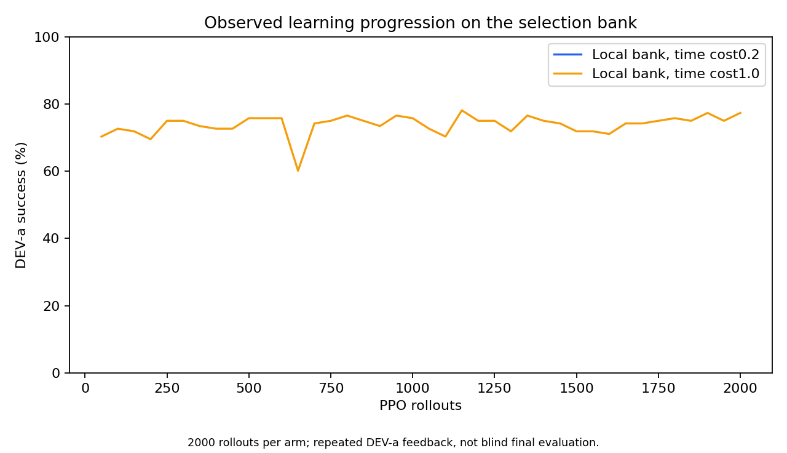
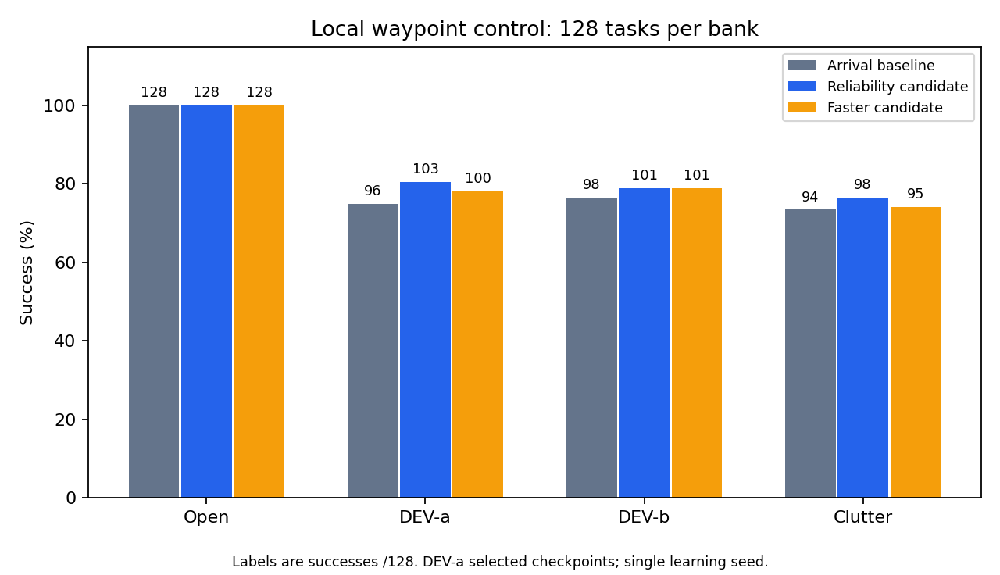
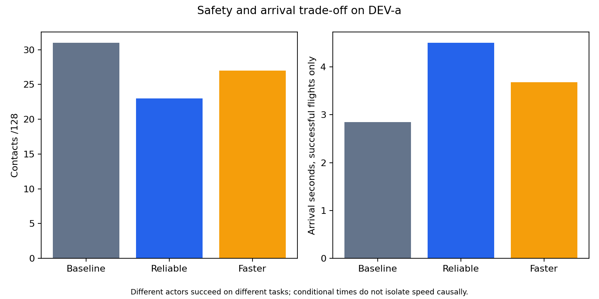
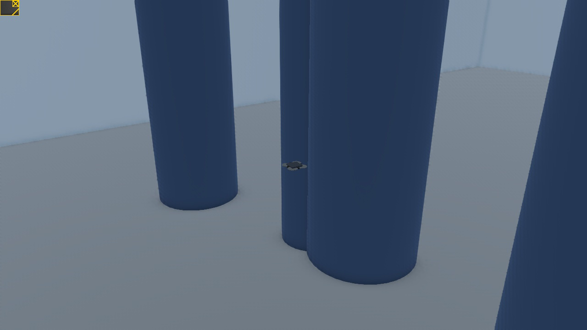

# Local waypoint learning and independent transfer

The PPO controller improves local avoidance on separate source geometry seeds.
The reliability candidate reaches 103/128 DEV-a tasks versus 96/128 for the
arrival warmstart, with slower arrivals. The faster candidate reaches 100/128.
These are experimental components, not default policies or full-route results.

| Frozen actor | DEV-a success/contact/timeout | Mean successful arrival |
|---|---|---|
| Arrival baseline | 96/31/1 | 2.85 s |
| Reliability candidate | 103/23/2 | 4.51 s |
| Faster candidate | 100/27/1 | 3.68 s |

Each arm ran 2,000 PPO rollouts: 128 environments × 32 steps, two epochs,
8,192,000 transitions. The local arms differ in time cost, 0.2/s versus 1.0/s;
the control trains the existing stage-2 distribution. Actor and critic are
warmstarted from the arrival checkpoint; optimizer moments and log standard
deviations reset. Gamma is .99, GAE lambda .95, learning rate 1e-4, entropy
coefficient .001 and value coefficient .5. Training mode 22 uses the deployed
mode-17 action map. Original baselines remain unchanged.

The local bank has 1,024 TRAIN tasks and separate 128-record DEV banks. Tasks
use 1–3 m provided goals, arbitrary initial yaw and velocity up to 1 m/s,
static geometry, 20 s budgets, 1.5 m/s command caps and a .18 m collision radius.
`wclearance` already subtracts that radius: the .30 m endpoint threshold is
BODY clearance. Geometric witnesses establish a path; they do not prove every
reset dynamically recoverable. Actor inputs contain depth, ego state and the
provided goal. The privileged critic is discarded at deployment.





DEV-a selected checkpoints. DEV-b and clutter use other scene seeds. Root
checked actual 1,024 TRAIN and 128 DEV records: no shared scene seeds. The
initial separation script checked empty lists from wrong paths; the published
proof is corrected and requires 128 records. A single learning seed and small
paired gains do not establish statistical superiority. Arrival means condition
on each actor's own successes. Training episode times include ALL completed
episodes; active-episode clearance is not a complete-training minimum.

## Independent native test

Sixteen tasks were declared in fixed bank order before target flights. Both
frozen actors ran actual RAPTOR, Webots ODE motors, collisions and RangeFinder
sensors.

| Actor | Metal, same 16 | Webots, same 16 |
|---|---|---|
| Arrival | 12 success / 3 contact / 1 timeout | 11/4/1 |
| Faster candidate | 12/3/1 | 12/3/1 |

Root checked 32 receipts and 276 artifact hashes; 31/32 terminal verdicts match.
The subset ties in Metal, so the +1 native difference is not a transferred
source improvement on these 16. No target training occurred. This tests LOCAL
1–3 m navigation, not global routing, moving obstacles, noise or a blind suite.

A discarded first pass used the legacy RAPTOR reference at (0,0,1.5), yaw 0,
despite varied spawn poses. Resetting the reference to the declared start fixed
that adapter defect. No weights changed. Stable success remains a .35 m radius,
speed at most .5 m/s for .2 s, with a 20 s budget and contact failure.

[](../artifacts/videos/native-local-waypoint.mp4)

The clip is one selected successful re-run of the first successful new-actor
case. It is an actual Webots scene recording. See
[native evidence](../evidence/inputs/local-waypoint-transfer/root-review.json).

## Inputs and remaining failures

Root's source audit reproduces all 128 faster-candidate DEV outcomes. In 17/27
contacts, the colliding geometry never appeared in 320 measured rays or 80
pooled bins. Six complete obstacles were outside the field of view throughout.
An 80×64 analytic grid at the same poses and field of view revealed none of the
other 11; occlusion or other visibility ambiguity remains. This does not prove
every safe decision was unobservable, or that seeing any part of an object
reveals its contact surface. Geometry truth only labels failures; it never
enters actor commands. [Records and limits](../evidence/inputs/local-waypoint-transfer/visibility-summary.json).

Whole-route composition passes the first wall in 2/3 TRAIN corner cases with
zero contacts, but completes 0/3. Belief persistence, route commitment, useful
viewing, control and time remain unresolved. A separate source-awareness
mission studies training fundamentals. Local tasks do not replace the full goal.

## Code, provenance and reproduction

[Current runner](../navigation_waypoint_training.mm) reuses production Sim,
PPOTrainer, RAPTOR and navigation_task_step. One new reset kernel installs kept
bank poses and goals after normal reset. The typed v2 resume contract binds the
bank, configuration, sensor profile, runner and compiled source before loading
or writing. Twelve plus resumed twelve rollouts match uninterrupted 24;
13 wrong-contract cases fail before loading. Completed v1 sidecars remain
immutable and cannot full-resume; parameter warmstarts are explicit.

Root recovered both original training runner files from successful literal
journal writes and edits. Their SHA-256 hashes exactly match sidecars:
reliability `12d3319fc7d8…`, fast `0d25ab9391b2…`.
[Archive](../evidence/inputs/local-waypoint/proof/training-runners.tar.gz),
[recovery receipt](../evidence/inputs/local-waypoint/proof/source-recovery.json).
The original runtime shader archive was not pinned. Current kernel identity
and exact evaluation and bank regeneration are separate evidence. Exact
original training replay from current code alone is not claimed.

From the repository root:

```sh
cmake -S . -B build
cmake --build build --target metal_nav_waypoint -j2
mkdir -p results
build/metal_nav_waypoint local-eval assets/checkpoints/local-waypoint-fast-experimental.bin.best results/local-dev.csv --spec dev-a --mode 17
python3 local_waypoint_results.py
python3 webots/local_waypoint_transfer.py select
```

The native runner writes new results under `results/local-waypoint-transfer`.
Set `WEBOTS_EXECUTABLE` for another installation. Compile
`webots/controllers/local_waypoint_transfer` with `WEBOTS_HOME`, then run the
runner's `flight`, `report` and `video` commands. It uses owned processes,
port 23456, batch/minimize and the absolute shared GPU lock. Native recording
is the visible-window exception. The shared Webots installation is read-only.

Published [episode records](../evidence/inputs/local-waypoint/evaluation-records.csv)
contain all 15,360 evaluation rows, including camera sensitivity and delay arms.
The [manifest](../evidence/inputs/local-waypoint/manifest.json) binds inputs,
plots and source. All data are development evidence. Original FINAL geometry
was exposed by earlier research; fresh sealed final evidence is required after
policy and navigation logic are frozen.
