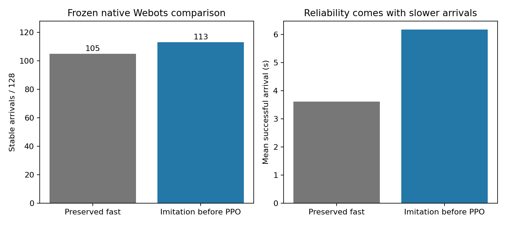

# Learned inspection transfers to Webots, with a speed tradeoff

The source-trained imitation navigator reaches **113/128** local development
goals in independent Webots flights, compared with **105/128** for the
preserved fast policy. No weights or navigation logic were trained in Webots.
The gain comes from blocked routes; all 85 direct tasks succeed for both.
This is useful transfer evidence, while the full goal remains incomplete.

| Frozen navigator | Success | Contact | Timeout | Blocked-route success | Successful arrival mean |
|---|---:|---:|---:|---:|---:|
| Preserved fast | 105/128 | 23/128 | 0/128 | 20/43 | 3.61 s |
| Imitation before further PPO | 113/128 | 14/128 | 1/128 | 28/43 | 6.17 s |

The imitation policy wins 15 paired tasks and loses 7, for a net gain of 8.
The predeclared primary subset balances 43 blocked and 43 direct tasks;
it has the same net gain. All 128 tasks also appear in the secondary full-bank
result. No failed or invalid task was removed: all 256 flights passed the
declared process and controller checks.



## What was trained and what stayed frozen

The imitation policy starts from the prior PPO navigation checkpoint and
learns commands from successful physical source-simulator flights. Its
teacher brakes and turns toward the supplied goal before continuing with
the prior navigator. The deployed policy is the learned actor plus the
unchanged geometry guidance and trajectory adapter; it does not call the
teacher or receive obstacle truth. The command interface remains body
velocity plus yaw rate, followed by the frozen RAPTOR motor controller.

The fixed checkpoint is `b8565035…`; exported NAV is `9b4a1164…`.
The fast NAV is `5b636f09…`. Source DEV-b results were 105/128 for imitation
and 101/128 for fast. The native test uses the same supplied goals, task
records and stable-arrival contract: radius 0.35 m, speed at most 0.5 m/s,
hold at least 0.2 s, and a 20 s deadline. Webots supplies its own physics,
motors, depth measurements and collisions. Goal selection and semantic
reasoning are outside this test.

## Scope and limits

These are exposed development scenes from the existing local generator,
not a sealed FINAL, unseen obstacle-family benchmark or hardware proof.
The tests cover nominal static 1–3 m local goals, including detours through
the procedural poles, doors, furniture, rooms and vertical-choice geometry.
They do not establish dynamic avoidance, wind, noisy state estimation or
broad disturbance robustness. Imitation is more reliable here but slower;
the next training work must improve both outcomes.

The original harness attempted the batch through background print-session
jobs. It retained incomplete per-flight records but did not durably save
the whole cohort's process results. Those records remain on disk. The
complete result here comes from a fresh parent-owned execution with a new
`rootdbf-` namespace, unchanged task selection, weights and navigation logic,
and a durable status record after every flight. No target-side adjustment
was made from those attempts. Source snapshots in the evidence bundle were
collected after the complete run; they are not claimed as an independently
archived pre-run build. Exact world and NAV hashes are verified.

One fast flight contacts an obstacle on the deadline tick, so its raw
receipt flags both contact and timeout. The existing source/report convention
counts contact first, then success, then timeout. The raw flags are retained.
All 218 reported successful arrivals have individually checked hold, speed
and final-distance receipts.

## Reproduce the evidence review

```sh
python3 native_bc_transfer_review.py
python3 native_bc_transfer_review.py --figure artifacts/plots/native-bc-transfer.png
```

The review uses the standard library; plots also require matplotlib.
[The hashed evidence bundle](../evidence/inputs/native-bc-fast/records.tar.gz)
contains all 256 world files, controller receipts, flight traces, logs and
process results, the fixed NAVs, task bank, selection manifest and runner/
controller source snapshots. The script checks every archived hash, task
identity, loaded policy/controller, process exit, grader and stable arrival
before it computes the table. This reproduces result analysis; rerunning the
simulator requires Webots and the documented controller dependencies.

## Actual paired doorway recordings

The following are native Webots scene movies of the same DEV-b env127
start, goal and world used in the full benchmark. The fast policy contacts
the doorway at 2.75 s. The imitation policy passes through and reaches
the stable-arrival criterion at 9.1 s. Both recorded reruns reproduce their
original scored outcomes with the same frozen NAV weights.

- [Baseline contact — actual scene video](../artifacts/videos/native-doorway-baseline-contact.mp4)
- [Learned successful passage — actual scene video](../artifacts/videos/native-doorway-learned-success.mp4)
- [Recording proof and video hashes](../evidence/inputs/native-doorway-pair/proof.json)
- [Worlds, controller, logs, trajectories and receipts](../evidence/inputs/native-doorway-pair/records.tar.gz)

This case was selected after the complete development benchmark to show a
paired failure and rescue. It is not a random sample, a new scored episode,
or a training-progression sequence. The imitation checkpoint is a different
policy; these videos do not show PPO gradually solving this one case.

The observer pans toward the drone. It moves from the near room to the far
room after the drone passes the wall (x > 2.10 m), so the wall does not hide
the rest of the flight. The separate recording controller changes only that
spectator camera. Vehicle sensing, control, physics, world collision geometry
and scoring are unchanged. Frames come from Webots movie recording, not
trajectory reconstruction. Failed camera attempts remain in local results.

The recording archive includes the actual worlds and the recording-only
controller source/Makefile, plus the two process and episode receipts. The
parent benchmark archive above contains the source task bank, frozen NAV
assets and generator needed to rerun this selected case. Webots R2025a is
required; normal benchmark runs remain batch/minimized. Visible recording
is a presentation exception, not a different evaluation protocol.
