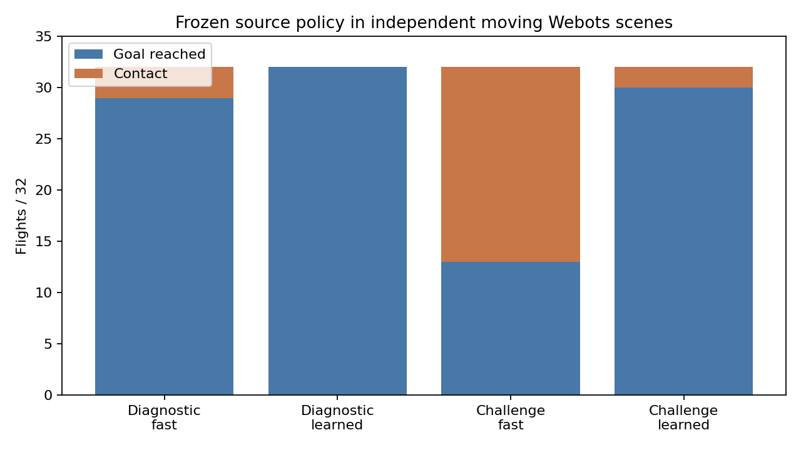

# Moving obstacles in Webots

I froze a policy trained with PPO in Metal and ran it in Webots against the
preserved fast navigation policy. Webots supplied the quadrotor physics,
RangeFinder depth, motors and contacts. Both policies sent body velocity and
yaw-rate commands through the same trajectory adapter and frozen RAPTOR.
There was no Webots training or policy adjustment between flights.

The benchmark contains two panels of 32 tasks. Each task was flown by both
policies, giving 128 actual native flights. The tasks were selected from
construction labels before the native outcomes were available.

| Panel | Policy | Goals reached | Contacts | Timeouts |
|---|---|---:|---:|---:|
| Diagnostic | Fast control | 29/32 | 3 | 0 |
| Diagnostic | Dynamic-trained policy | 32/32 | 0 | 0 |
| Harder challenge | Fast control | 13/32 | 19 | 0 |
| Harder challenge | Dynamic-trained policy | 30/32 | 2 | 0 |



On the challenge panel, the dynamic-trained policy completed 17 tasks that the
control missed. The control completed no task that the new policy missed.
For the same 13 tasks completed by both, mean arrival was 3.70 s versus 4.08 s,
a 0.38 s reduction. In the easier diagnostic panel it was slower by 1.02 s on
the 29 shared successes. Means over different successful task sets are also
retained in the [computed review](../evidence/inputs/native-moving/review.json).

The diagnostic panel uses paired nonselector tasks with 0.5/0.75 m/s movers.
The challenge panel adds faster approach and crossing cases from the exposed
source development selector. This tests frozen transfer to independent physics
and sensing; it is not the sealed final evaluation. Ego sensing is ideal, and
noise, wind and added latency are separate outstanding tests. The source
dynamic checkpoint's earlier static-retention failures remain recorded.

## What ran

The moving geometry is copied from the actual 908-byte dynamic-bank records.
A separate Supervisor moves each obstacle along its declared linear trajectory.
Its observed position is logged every 50 ms and checked against the episode
clock. Geometry and motion schedules build the world and grade the test; they
are not navigation-policy inputs.

Each flight has its own world, manifest, process result, episode verdict,
trajectory and log. All 128 receipts show exit zero, loaded navigation and
RAPTOR models, and shared task grading. Successful flights satisfy the 0.35 m
goal region, speed at most 0.5 m/s and 0.2 s hold. Contacts are retained as
failures. World, NAV and mover-controller hashes are verified by the reviewer.

The full-trained NAV asset is
`e7d665eaa0c055d03427f5a5ec3e360613059c7cb878b2351c7c08cb42aa5563`;
the control is
`5b636f0984c953641d03140e38b657013c6b5b9a5560e0afa4fe7a8fd64c8cc0`.
Both exports matched their source actors with zero measured export error.

## Reproduce the review

The [raw archive](../evidence/inputs/native-moving/records.tar.gz) contains
916 hashed inputs: all flights, task banks, frozen NAV assets, exporter,
controller and batch sources, selections, and the protocol correction.

```sh
python3 native_moving_review.py --out /tmp/native-moving-review.json \
  --plot /tmp/native-moving-transfer.png
```

The numerical review uses the standard library; plotting needs Matplotlib.
Native reruns require Webots R2025a and the repository's quadrotor/controller
build. Normal runs use the isolated RL project, port 23456 and batch/minimized
mode. Saved absolute paths must be adjusted for a different checkout.

Before this batch, root corrected an export that used a checkpoint instead of
NAV weights and a timeout that stopped a wrapper while its simulator continued.
During the batch, an overly strict export gate rejected a source box extending
through the floor. The box was kept exactly as recorded; only that invalid
containment requirement was removed. The 82 completed flights were retained
and only the remaining 46 were run. No task or policy was changed to obtain a
better score.
