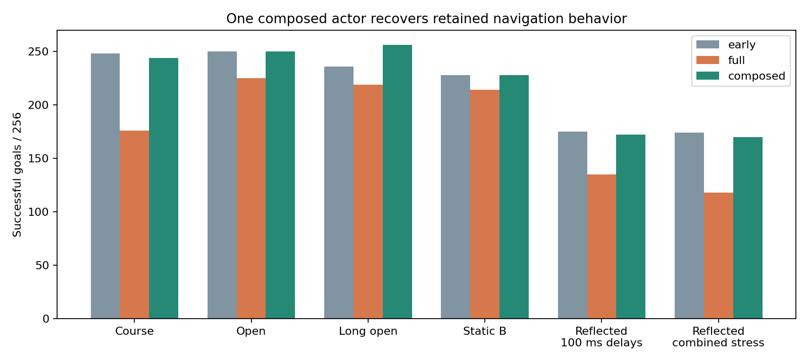

# Recovering useful translation and keeping the learned turn behavior

I separated the early and late policies' outputs to find which behavior was lost.
Restoring the early yaw output did not solve the problem. Restoring early XYZ
velocity outputs while keeping the late yaw output recovered 67 of 73 course
tasks that continued PPO had lost. It introduced two failures on tasks the late
policy still solved. Both tests used the same current depth and ego observation,
geometry guidance, control adapter, RAPTOR and motors.

This is a direct output intervention. It identifies translation behavior as the
useful recovery target on these development courses; it does not establish which
optimizer mechanism erased it. The completed gradient audit proposed advantage
clipping, but an earlier experiment already found that harmful. I also corrected
its policy-active diagnostic and rejected claims that gradient clipping fixes
Adam's step size or that nearly orthogonal updates prove noise.

The initial intervention ran two frozen networks. I then combined them into one
MLP: concatenate their hidden neurons, keep the early XYZ output-head weights,
and keep the late yaw output-head weights. The unused output connections are
zero. The resulting 184/5120/4 actor has 967,688 parameters. It has one observation
and one forward pass; there is no runtime policy selector or second teacher.
Its FP32 actor parameters occupy about 3.9 MB, so this is a research candidate
for later compression and deployment measurement.

The [composition helper](../navigation_compose_checkpoint.py) checks the algebra
on independent inputs. I also ran the single actor through the simulator on all
12 development panels used for the successful intervention. All 1,536 scored
flight CSVs match the two-network intervention byte for byte, including final
positions, flight times and collision results. These are parameter-only
inference/warmstart candidates, not resumable training checkpoints.



Each result pools two training seeds on 128 tasks each. The early and late
reference flights were retained from the completed actor-step comparison.

| Source panel | Early success/contact/timeout | Late | One composed actor |
|---|---:|---:|---:|
| Nominal course | 248/8/0 | 176/79/1 | **244/12/0** |
| Short open | 250/0/6 | 225/0/31 | **250/0/6** |
| Long open | 236/0/20 | 219/0/37 | **256/0/0** |
| Static B | 228/18/10 | 214/25/17 | **228/17/11** |
| Reflected course, both 100 ms delays | 175/81/0 | 135/120/1 | **172/84/0** |
| Reflected course, combined stress | 174/81/1 | 118/137/1 | **170/86/0** |

The long-open result exceeds both individual references. The late turn behavior
can help while the early translation behavior retains avoidance. On the course,
common successful arrivals are 0.09 s faster for seed 1 and 1.13 s faster for
seed 2 than the late actor. The reflected stress cases still fail often, and
short open still has six timeouts. This is exposed source development evidence;
no new learning, blind final test or independent simulator transfer was performed.
The default policy remains unchanged.

The next learning experiment targets the behavior we recovered: a training-only
loss that keeps useful physical XYZ velocity means close to this frozen teacher
while PPO continues to improve the student. It supervises no yaw output directly
and uses no privileged geometry. Shared hidden features can still change yaw,
so the experiment must measure that effect and broad retention. The teacher is
removed at inference. Code, derivative checks, resume parity and a frozen pilot
request come before another training campaign.

The [135-record bundle](../evidence/inputs/action-channel/records.tar.gz) contains
both composed candidates, parent parameter prefixes, all flight tables, execution
receipts, source and the registered intervention gates. Recompute the grade and
figure without rerunning flights:

```sh
python3 navigation_action_channel_results.py \
  evidence/inputs/action-channel/records.tar.gz \
  --output evidence/inputs/action-channel/review.json \
  --plot artifacts/plots/action-channel.png
```

To recreate a candidate after extracting the bundle's model files:

```sh
python3 navigation_compose_checkpoint.py \
  models/early-s1.bin models/full-s1.bin composed-s1.bin
```
