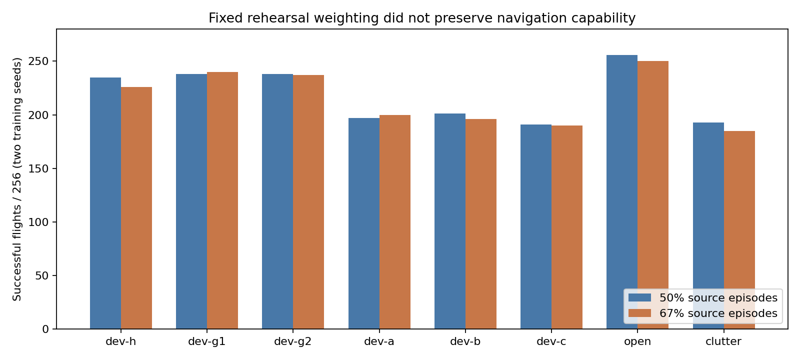

# Fixed rehearsal weighting: negative result

Four fresh source PPO runs completed 10,000 rollouts each, with two matched
training seeds. Each saved checkpoint records 320,000 optimizer steps. All
64 evaluations completed with exit code zero: final and selected checkpoints,
eight task banks, two schedules and two seeds.

The only intervention was the episode schedule. The control serves original
source and new local tasks equally. Treatment serves 16 original-source slots
and eight new slots per cycle: 67% source episodes, not 75%, and not necessarily
67% of transitions. Reward, physics, inputs, network and optimizer are fixed.
This tests fixed rehearsal weighting; it does not test adaptive failure replay.

## Final checkpoint outcomes

Counts pool two training seeds, 256 flights per row and schedule.

| Task bank | 50% source: success / contact / timeout | 67% source: success / contact / timeout |
|---|---:|---:|
| Fresh nonselector dev-h | 235 / 21 / 0 | 226 / 30 / 0 |
| Selector dev-g1 | 238 / 18 / 0 | 240 / 16 / 0 |
| Nonselector dev-g2 | 238 / 18 / 0 | 237 / 19 / 0 |
| Existing dev-a | 197 / 59 / 0 | 200 / 55 / 1 |
| Existing dev-b | 201 / 55 / 0 | 196 / 59 / 1 |
| Existing dev-c | 191 / 65 / 0 | 190 / 65 / 1 |
| Open | 256 / 0 / 0 | 250 / 0 / 6 |
| Clutter | 193 / 63 / 0 | 185 / 70 / 1 |



Both matched acceptance tests failed. Fresh blocked dev-h successes fell
45/66 to 36/66; old dev-c fell one success instead of improving by at least
six. Treatment also missed the absolute dev-c, open and clutter retention
floors. Selected checkpoints do not rescue this claim: fresh blocked dev-h
46/66 versus 44/66, and dev-c 197/256 versus 188/256.

**Not adopted.** This rules out this schedule at this budget as the solution
to the measured interference. It does not prove that rehearsal, PPO or longer
training cannot work. It does show that increasing the share of old episodes
alone did not protect the old behavior. No default checkpoint was changed.

## Evidence and reproduction

[Raw records and source snapshot](../evidence/inputs/rehearsal/records.tar.gz)
contain 127 hashed files, including all 64 flight CSVs, histories, actual
checkpoint header receipts, frozen task banks, source files, commands and
predeclared gates. The matched-seed addendum supersedes the earlier two-run
request before training. [Computed review](../evidence/inputs/rehearsal/review.json)
preserves successful-arrival time, all-episode time and paired wins/losses.

Run from the repository root:

```sh
python3 rehearsal_review.py --out /tmp/rehearsal-review.json \
  --plot /tmp/rehearsal-results.png
```

The reviewer verifies each archived hash, every denominator, terminal outcome,
successful hold and paired geometry before computing the result. Plotting needs
Matplotlib; the numerical review uses the Python standard library.

These are source development results. Existing retention sets were exposed;
dev-h was constructed and frozen before training, and was not the selector.
There is no independent simulator or sealed final-test claim in this study.
