# Results gallery

Every figure, training record and video in this repository, with a caption, the data it was built from, and the document section that explains it.

**How to read this page**

- Each figure entry states *what it shows*, *the numbers in it*, *the exact input files*, and *where the full protocol is documented*.
- Most figures have an SVG twin in [`artifacts/`](../artifacts). The reward audit below supplies a PNG and a separate reproduction command.
- Rebuild all figures and their input-hash manifest without running Metal:

  ```sh
  python3 evidence.py --out artifacts
  ```

  [`artifacts/manifest.json`](../artifacts/manifest.json) records the command, the per-figure input filter, metric definitions and the stated limitations of each figure. The compact inputs live in [`evidence/inputs/`](../evidence/inputs).

- Paths under `results/` and `build/` are **gitignored working directories**. Entries marked *(local)* exist on this machine but are not part of the pushed repository, so those links will not resolve on GitHub.
- Nothing on this page is a hardware or airframe-fidelity claim. Simulation, parity and Webots results are labelled as such.

---

## Navigation reward and credit audit

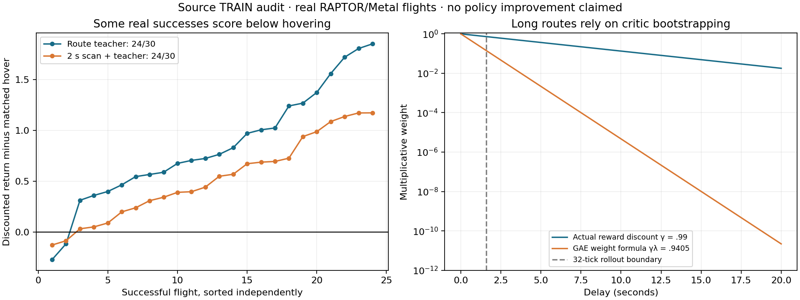

120 real RAPTOR/Metal TRAIN episodes, 27,222 transitions: the selected actor
contacts on 30/30 corners; privileged teachers complete 24/30. Two of those
successful flights score below matched hovering in the finite discounted
reward sum. The right panel is an analytical parameter-weight curve, not a
training result; GAE still uses critic bootstrapping at rollout boundaries.
No learned policy improved in this audit.

Inputs: [episode table](../evidence/inputs/reward-audit/episodes.csv),
[compressed transitions](../evidence/inputs/reward-audit/transitions.csv.gz),
[provenance](../evidence/inputs/reward-audit/proof.json).
[Protocol and limitations](RESEARCH_CREDIT_ASSIGNMENT.md).
Rebuild with `python3 reward_audit.py`.

## Videos

### Native Webots recordings

These two are the requested course videos: **unmodified Webots R2025a Supervisor movie output** of the live main 3D view, 1280×720 at 25 fps, recorded in realtime with an opaque scene. The recording camera follows the real GPS body position with a fixed world offset; it only changes the observer view and never moves the drone, alters physics, or passes obstacle truth to the navigation policy.

| Clip | Policy | Objective | Result | Goal rule |
|---|---|---|---|---|
| [native-doorway.mp4](../artifacts/videos/native-doorway.mp4) | arrival (`navigation-arrival-experimental.bin`) | stable hold | **6.91 s, no contact, 0.2 s hold**, final speed 0.4504 m/s, 691 rows of 100 Hz pose+quaternion | within 0.35 m, speed ≤0.5 m/s for 0.2 s |
| [native-connected-rooms.mp4](../artifacts/videos/native-connected-rooms.mp4) | room (`navigation-rooms-experimental.bin`) | first entry | **5.23 s, no contact**, final speed 1.56434 m/s, 523 rows | first entry within 0.35 m — **not** a stable stop |

[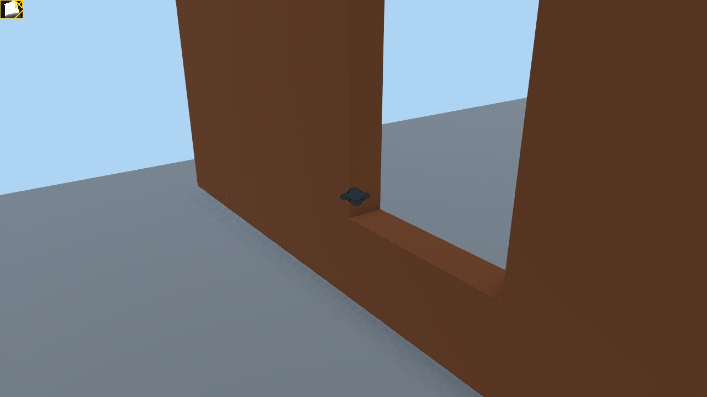](../artifacts/videos/native-doorway.mp4)
`artifacts/videos/native-doorway.mp4` — offset doorway, arrival policy, 6.91 s stable hold.

[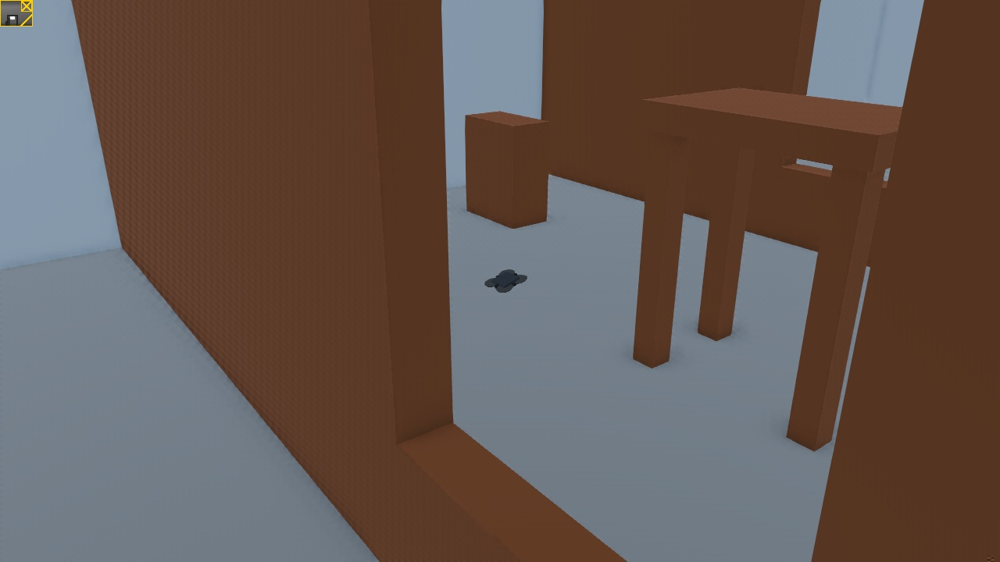](../artifacts/videos/native-connected-rooms.mp4)
`artifacts/videos/native-connected-rooms.mp4` — two offset doors with a table, room policy, first entry at 5.23 s.

**Limits stated with these clips:** two *selected successful examples*, not a success rate; the room policy was selected on development scenes and the final split is untouched; room success is first entry at 1.56434 m/s, not a stop; the visible airframe uses simple primitives rather than verified hardware CAD; collision uses a conservative 0.18 m sphere with clean depth and ideal ego sensors.

**Evidence and reproduction**

- [`evidence/inputs/native-flight-videos/manifest.json`](../evidence/inputs/native-flight-videos/manifest.json) — per-clip objective, result, blank-frame check, video SHA-256, source hashes, limitations.
- [`doorway-proof.json`](../evidence/inputs/native-flight-videos/doorway-proof.json) · [`connected-rooms-proof.json`](../evidence/inputs/native-flight-videos/connected-rooms-proof.json) — exact worlds, raw receipts, scene metadata, renderer logs.
- [`doorway-trace.csv`](../evidence/inputs/native-flight-videos/doorway-trace.csv) · [`connected-rooms-trace.csv`](../evidence/inputs/native-flight-videos/connected-rooms-trace.csv) — real 100 Hz ENU position and WXYZ quaternion samples.
- Reproduce: [`webots/README.md` → Native scene recordings](../webots/README.md#native-scene-recordings).
- Video hashes verified against the manifest: doorway `d6999483…b6190a2`, connected-rooms `5e0069a1…6543704`.

### Rejected and local-only recordings

| Item | What it is | Status |
|---|---|---|
| `results/native-recording-failures/doorway-partial-black/` *(local)* | A real native Webots capture that decoded to more than 3 s of near-black output. Physical episode succeeded; the movie failed the watchability gate. | Preserved as a **failure**, never published. |
| `artifacts/videos/doorway.mp4`, `artifacts/videos/connected-rooms.mp4` | **Blender cutaway reconstructions** of recorded Webots states — not camera footage. Provenance: `evidence/inputs/flight-videos/manifest.json` *(local only)* states "Blender cutaway reconstruction of recorded Webots states, not native camera footage". | **Rejected deliverables.** Not promoted, not linked as evidence, not to be committed. |
| `webots/results/**/flight.mp4` and `view-at-1s.jpg` *(local)* | Raw native Webots takes written by the benchmark runner, including intermediate and superseded recordings. | Working output; the two `artifacts/videos/native-*.mp4` files above are the canonical published takes. |
| `results/mimo-video-verification/fixtures/SYNTHETIC_FIXTURE_*.mp4` *(local)* | Deliberately synthetic fixtures used to self-test the verifier (one visible, one black). | **Never navigation evidence.** Labelled as fixtures in their own folder. |
| `webots/results/**/**.svg` *(local)* | Top-down GPS-trace reconstruction SVGs written per run. | Explicitly labelled reconstructions, not simulator screenshots ([`webots/README.md`](../webots/README.md)). |

The blank-frame gate is a watchability check only: it decodes every frame with ffmpeg and rejects more than 0.2 s of near-black output. It cannot validate vehicle CAD, physics fidelity or navigation generalization. Independent verifier CLI: [`webots/verify_flight_videos.py`](../webots/verify_flight_videos.py), report at `results/mimo-video-verification/report.md` *(local)*.

---

## Training throughput

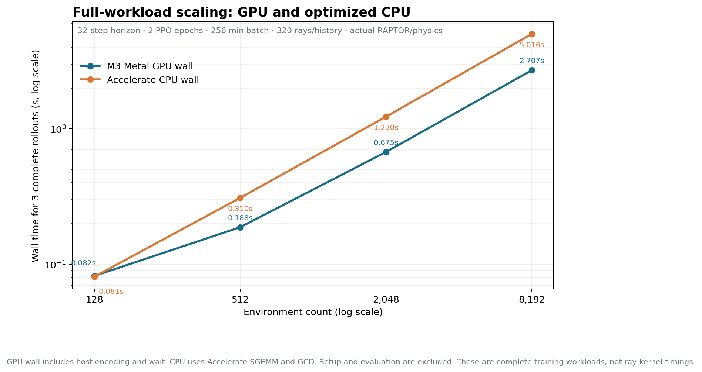

**Full PPO training workload (rollout + PPO update) on identical worlds and rays for both backends.** The workload is the raw 661-input actor, 128 environments × 32-step rollout, two PPO epochs, minibatch 256, FP32, with the actual controller, physics and sensor in the loop.

| Environments | GPU | CPU | CPU/GPU |
|---:|---:|---:|---:|
| 128 | 0.082 s | 0.081 s | ~0.99× |
| 512 | 0.188 s | 0.310 s | 1.65× |
| 2,048 | 0.675 s | 1.230 s | 1.82× |
| 8,192 | 2.707 s | 5.016 s | **1.85×** |

The gap widens with environment count; at 128 environments the matched CPU reference is still competitive. This is one of **three separate measurements on different workloads** and must not be combined into a single ratio — the large ~64× figure is versus this project's own original Metal implementation on a different workload, not versus CPU.

- Inputs: [docs/BENCHMARKS.md](BENCHMARKS.md) environment ladder (the figure reads the table).
- Full optimisation ladder inside Metal: baseline 1.66 s → direct batch-reduced gradients 0.295 s (43.8 MiB of scratch removed) → M3 SIMD reductions + fused 8×8 `simdgroup_matrix` actor forward ~0.026 s. [BENCHMARKS · Matched complete PPO optimization](BENCHMARKS.md#matched-complete-ppo-optimization)
- Geometry-memory evaluation, identical episode results: 3.08 s → 0.143 s. Same section.

---

## Training records

Training curves and the raw histories behind them. A curve is a *record of what a run did*, not evidence that the result generalizes.

### Open-room stable-arrival training (arrival candidate)

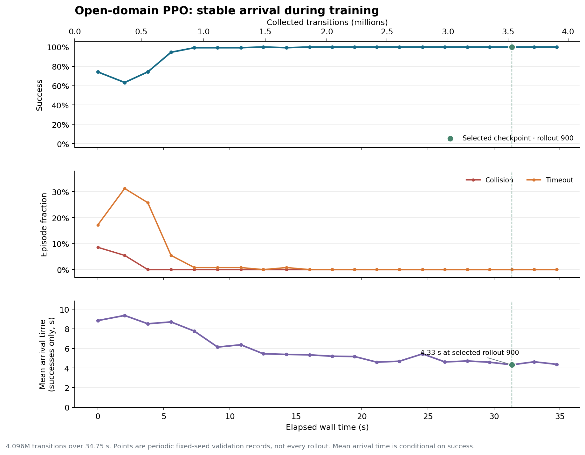

**All 21 logged evaluations of the open-domain arrival run, rollout 0 → 1000, selection seed 800001.** 1000 rollouts, 4.096 M transitions, **34.75 s wall**, train seed 42, selected at **rollout 900**. The arrival contract is distance ≤0.35 m, actual speed ≤0.5 m/s for 0.2 s, 20 s budget; collision uses the historical 0.18 m sphere.

- Inputs: [`evidence/inputs/arrival-training/history.csv`](../evidence/inputs/arrival-training/history.csv) (curve), [`evaluations.csv`](../evidence/inputs/arrival-training/evaluations.csv) (per-stage paired outcomes).
- Command and full contract: [`evidence/inputs/arrival-training/manifest.json`](../evidence/inputs/arrival-training/manifest.json) → `training_command`.
- Protocol: [docs/BENCHMARKS.md](BENCHMARKS.md) · this is a **single-seed foundation run**, not generalization proof.

### Broad curriculum validation over wall time

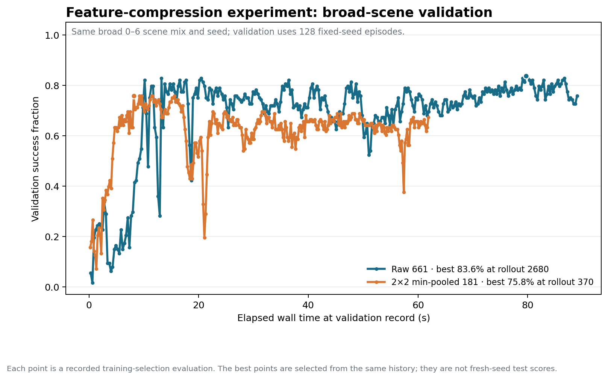

**Validation success against elapsed wall time for the broad 0–6 curriculum run.** Each point is a recorded validation at a checkpoint; selection never touches the final evaluation seeds. Note that a newer checkpoint is not automatically better — later, faster policies can miss goals.

- Inputs: [`evidence/inputs/training.tsv`](../evidence/inputs/training.tsv) (schema and metric definitions in [`artifacts/manifest.json`](../artifacts/manifest.json)).
- Filter: checkpoint basename `raw-broad.bin` or `pooled-broad.bin`.
- Protocol: [docs/BENCHMARKS.md · Real learning, open curriculum](BENCHMARKS.md#real-learning-open-curriculum)

### Focused connected-room PPO run (25/30 peak)

There is **no published curve image for this run** — its training history is the source record:

- [`evidence/inputs/room-training/focused-history.csv`](../evidence/inputs/room-training/focused-history.csv) — rollout → transitions, wall s, dev success, collision, timeout for the focused run.
- [`evidence/inputs/room-training/refinement-history.csv`](../evidence/inputs/room-training/refinement-history.csv) — the lower-learning-rate refinement, which did not improve on the peak.
- Selected vs final per-level results: [`focused-selected-dev.csv`](../evidence/inputs/room-training/focused-selected-dev.csv) (**25/30** dev rooms, 54/90 dev total) and [`focused-final-dev.csv`](../evidence/inputs/room-training/focused-final-dev.csv) (**10/30** dev rooms, 30/90 dev total).
- Provenance, command and hashes: [`evidence/inputs/room-training/manifest.json`](../evidence/inputs/room-training/manifest.json) — seed 52, family 15, λ 16, risk 0, selected at rollout 300 / 1,228,800 transitions, `policy_inputs: globalgoal,depth,egostate;nooraclewaypoints`.

**Reading it:** the peak is transient. Continued training collapsed capability, and the selected checkpoint is frozen. Development levels were used for selection; the final split was never evaluated.

### Failed run: corner detour training

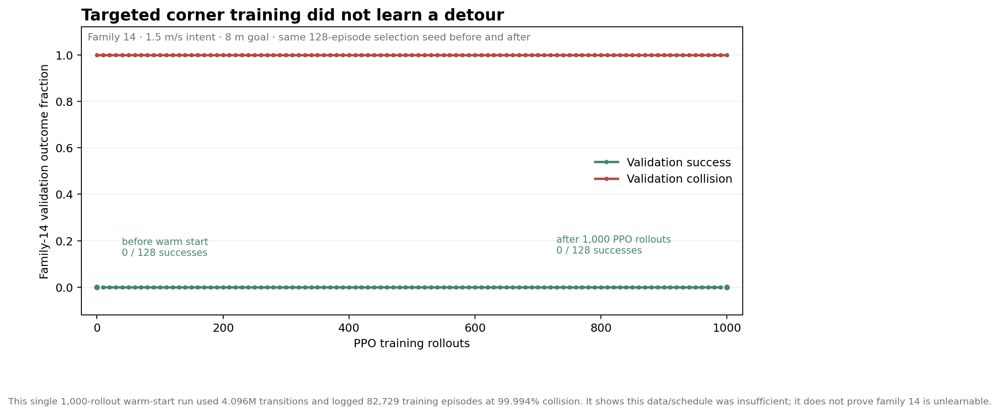

*The full corner-control run (family 14, warm start, 1,000 rollouts, 4.096 M transitions, 82,729 training episodes) kept validation at **0/128** with a 99.994% collision rate.*

The failed run is kept as evidence rather than deleted. One schedule failing to teach the detour does **not** show that the route is unlearnable.

- Inputs: [`evidence/inputs/corner-control.log`](../evidence/inputs/corner-control.log), [`corner-control-training.tsv`](../evidence/inputs/corner-control-training.tsv).
- Protocol: [docs/BENCHMARKS.md · Frozen challenge-bank development failures](BENCHMARKS.md#frozen-challenge-bank-development-failures)

### Local-only training and screening records *(not in git)*

| Path | What it holds |
|---|---|
| `results/mimo-room-learning/report.md` *(local)* | Delegated 1500-rollout knob search: three arms, each measured against the 25/30 baseline, none beat it (best alternatives 18/30 and 19/30). Includes the baseline re-verification (25/30 reproduced exactly), the 74-checkpoint screen, the warm-start audit and the sampler audit. |
| `results/mimo-room-learning/trajectories.csv`, `summary.csv` *(local)* | Per-arm rollout → dev family-15 success, and per-arm best dev scores with checkpoint SHA-256. |
| `results/mimo-room-learning/room-*.history.csv`, `room-*.log` *(local)* | Full training + dev-eval logs for each failed arm. |
| `results/mimo-room-learning/screen/*.csv` *(local)* | Exhaustive screen of all 74 checkpoint files on disk; none exceeds 25/30. |
| `results/room-seed-replication/seed54.bin.history.csv` *(local)* | Independent exact-recipe replication at seed 54, 400 rollouts. Peak dev family-15 **22/30** at the best checkpoint; the run never reached 25/30. |
| `results/arrival-resume*`, `results/potential-resume/` *(local)* | Byte-identical-resume checks (two continuous updates vs one plus one resumed produce an identical checkpoint including plant/task state) and the shaping-validation work in progress. |

---

## Arrival candidate vs preserved baselines

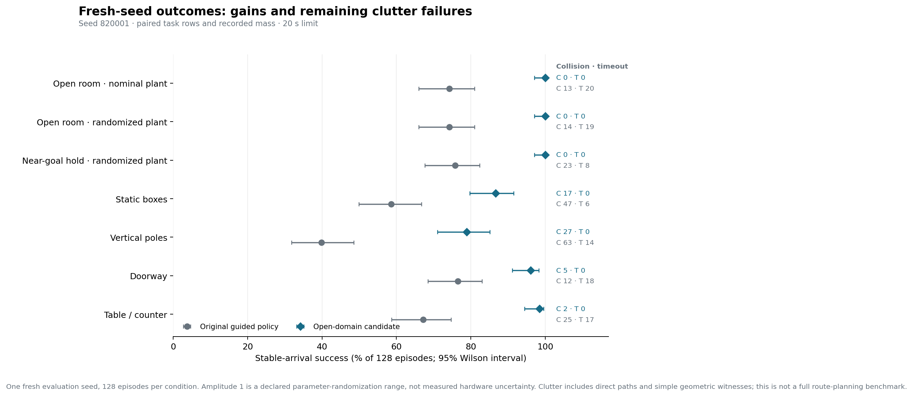

**Fresh evaluation seed 820001, 128 paired episodes per condition — identical start, goal, scene and mass between the two policies.** The candidate improves open/near-goal arrival and simple static clutter, and this is the basis for calling it an improvement on *those* tasks.

| Condition | Original | Arrival candidate |
|---|---:|---:|
| Open room, nominal (stage 0, amp 0) | 95/128 | **128/128** |
| Open room, varied dynamics (stage 0, amp 1) | 95/128 | **128/128** |
| Near-goal (stage 1) | 97/128 | **128/128** |
| Boxes (family 1) | 75/128 | 111/128 |
| Poles (family 2) | 51/128 | 101/128 |
| Doors (family 4) | 98/128 | 123/128 |
| Tables (family 5) | 86/128 | 126/128 |

Mean arrival time under varied dynamics fell from 8.19 s to 4.39 s. **These clutter scenes contain many direct routes; this is not long-route generalization proof.**

- Inputs: [`evidence/inputs/arrival-training/evaluations.csv`](../evidence/inputs/arrival-training/evaluations.csv), [`initial-dev.csv`](../evidence/inputs/arrival-training/initial-dev.csv), [`selected-dev.csv`](../evidence/inputs/arrival-training/selected-dev.csv).
- Contract and limits: [`evidence/inputs/arrival-training/manifest.json`](../evidence/inputs/arrival-training/manifest.json).

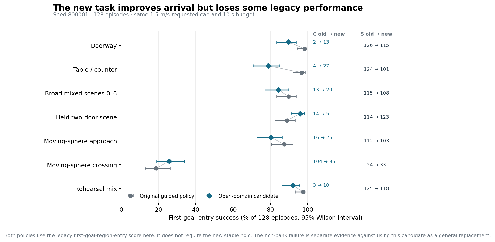

**Why the candidate is NOT a replacement.** Same seed 800001, 128 episodes, 10 s budget, 1.5 m/s requested cap, both checkpoints scored with the legacy first-goal-region-entry rule: tabletop **124 → 101/128**, mixed **115 → 108/128**, while held two-door improves 114 → 123/128. The original, static and moving-threat policies and six source checkpoints remain preserved.

- Inputs: [`evidence/inputs/arrival-training/retention.csv`](../evidence/inputs/arrival-training/retention.csv), [`retention.log`](../evidence/inputs/arrival-training/retention.log).
- Decision recorded in the manifest as `replacement_decision`: **Rejected as a replacement.**

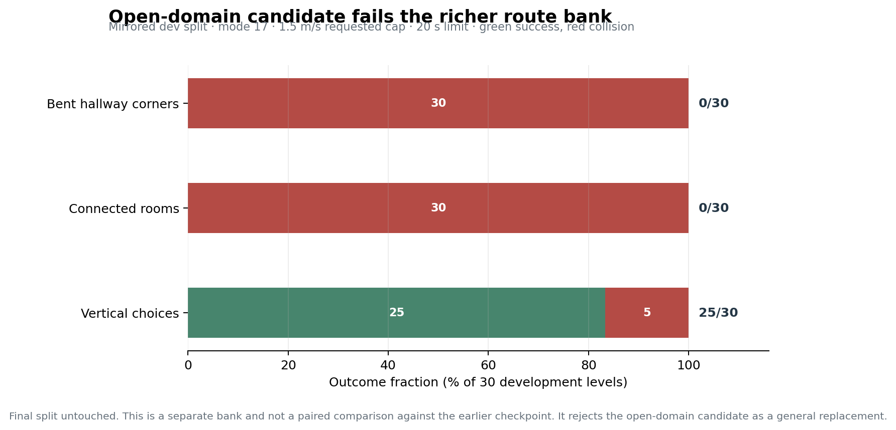

**The candidate on the 90 mirrored development levels (candidate only, no matched baseline).** Result **25/90**: bent hallways 0/30, connected rooms 0/30, vertical over/under 25/30. This is the clearest statement of the ceiling the arrival candidate does not break.

- Inputs: [`evidence/inputs/arrival-training/rich-dev.csv`](../evidence/inputs/arrival-training/rich-dev.csv), [`evidence/inputs/challenge-bank-mirrored-v1.jsonl`](../evidence/inputs/challenge-bank-mirrored-v1.jsonl).
- Final split untouched; see [Long-route challenge-bank capability](#long-route-challenge-bank-capability).

---

## Long-route challenge-bank capability

A separate frozen bank stores **270 explicit scenes: 90 train, 90 development, 90 final** across a bent hallway, connected rooms with offset doors, and vertical over/under choices. Only the 90 development levels were scored anywhere in this repository. **The final split remains untouched.**

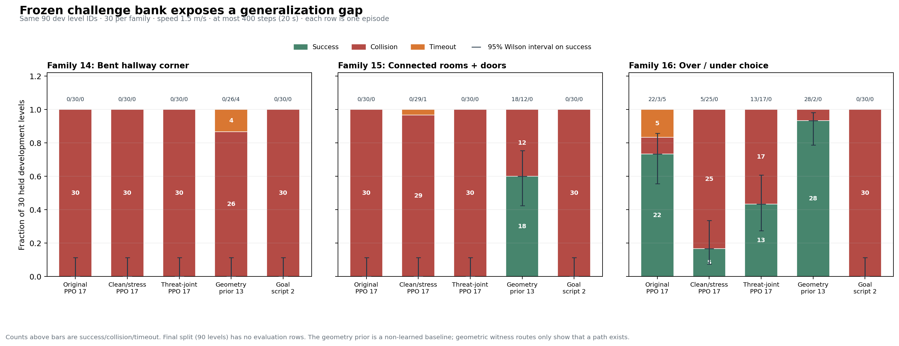

**Per-family outcomes on the frozen 90 development levels, 30 per family, 1.5 m/s requested cap, 20-second episode limit.**

| Policy | Bent hallway | Connected rooms | Vertical over/under |
|---|---:|---:|---:|
| Original | 0/30 | 0/30 | 22/30 |
| Static | 0/30 | 0/30 | 5/30 |
| Moving-threat (dynamic) | 0/30 | 0/30 | 13/30 |
| Geometry-only prior (mode 13) | 0/30 | **18/30** | **28/30** |
| Goal script | 0/30 | 0/30 | 0/30 |

These results show large domain gaps and do not support broad navigation generalization. The geometry prior is a strong baseline and is always shown next to the learned policy rather than hidden.

- Inputs: [`evidence/inputs/bank-original.csv`](../evidence/inputs/bank-original.csv), [`bank-static.csv`](../evidence/inputs/bank-static.csv), [`bank-dynamic.csv`](../evidence/inputs/bank-dynamic.csv), [`bank-geometry.csv`](../evidence/inputs/bank-geometry.csv), [`bank-goal.csv`](../evidence/inputs/bank-goal.csv), [`challenge-bank-v1.jsonl`](../evidence/inputs/challenge-bank-v1.jsonl).
- The focused room run's **25/30 dev rooms** is the improvement over the original's **0/30** in this family: [room-training manifest](../evidence/inputs/room-training/manifest.json). Its later collapse to 10/30 is recorded in the same manifest's inputs.

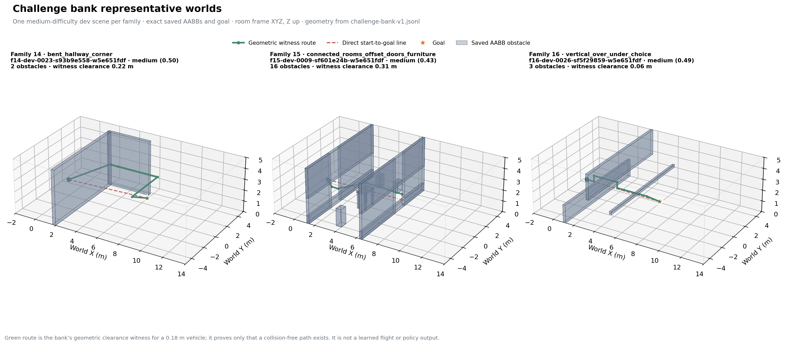

**One development level per family from the saved bank, with its geometric witness route (green).** The witnesses are computed paths with positive clearance for a 0.18 m vehicle — they show that a collision-free route exists. **They are not learned trajectories** and they are never sent to the actor.

- Input: [`evidence/inputs/challenge-bank-v1.jsonl`](../evidence/inputs/challenge-bank-v1.jsonl); selection filter in [`artifacts/manifest.json`](../artifacts/manifest.json).
- Scripted witness execution through frozen RAPTOR and simulator physics: 90/90 pass at 1.0 m/s with a 60 s limit; at 1.5 m/s with a 20 s limit, 69/90 pass and 21 time out. Because the controller receives the stored waypoints, these are **route-execution checks, not autonomous navigation**. Inputs: [`bank-witness-1mps.csv`](../evidence/inputs/bank-witness-1mps.csv), [`bank-witness-1.5mps.csv`](../evidence/inputs/bank-witness-1.5mps.csv). Protocol: [BENCHMARKS · Privileged witness-route execution](BENCHMARKS.md#privileged-witness-route-execution).

**Oracle routing diagnostic (no figure — source record):** given privileged intermediate waypoints, the arrival actor completes **30/30** connected rooms (all ≤15.86 s), 9/30 corners (only 2 within 20 s) and 27/30 vertical, while with the final goal alone it stays at 0 corners / 0 rooms. This shows that route guidance helps the arrival baseline; it does not isolate every remaining failure cause; it is an oracle diagnostic, not an autonomous score. Input: [`evidence/inputs/pipeline-diagnostics/privileged-waypoints.csv`](../evidence/inputs/pipeline-diagnostics/privileged-waypoints.csv) and its [manifest](../evidence/inputs/pipeline-diagnostics/manifest.json). Protocol: [BENCHMARKS · Routing and generator diagnostics](BENCHMARKS.md#routing-and-generator-diagnostics).

---

## Webots transfer

Independent Webots R2025a runs: ODE physics, native RangeFinder, frozen RAPTOR and Propeller motors at 1 ms physics / 10 ms control / 50 ms navigation. Launches use `--minimize --batch` on the RL-only port 23456. Sensors are ideal ego outputs with clean depth; collision uses the same 0.18 m sphere.

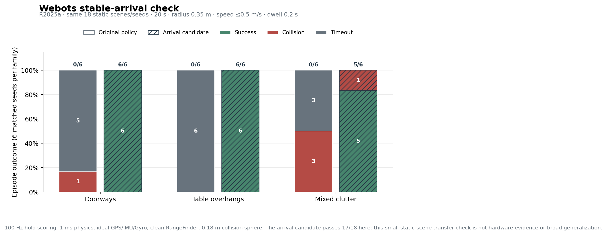

**Matched 20 s stable-arrival test on 18 static scenes (6 doorways, 6 tables, 6 mixed clutter) × 2 policies.** Stable arrival requires error ≤0.35 m, world speed ≤0.5 m/s and 0.20 s dwell, checked at 100 Hz in Webots.

| Policy | Goal-region entries | Successful holds | Contacts | Timeouts |
|---|---:|---:|---:|---:|
| Original (`navigation.bin`) | 17/18 | **0/18** | 4 | 14 |
| Arrival candidate | 17/18 | **17/18** | 1 | 0 |

The arrival candidate's 17 holds are doors 6/6, tables 6/6, mixed 5/6; its single failure (mixed seed 41004) contacted the envelope before goal entry. Every success had a full 0.20 s dwell and final speed ≤0.5 m/s.

- Inputs: [`evidence/inputs/webots-stable-arrival/episodes.csv`](../evidence/inputs/webots-stable-arrival/episodes.csv), [`runs.json`](../evidence/inputs/webots-stable-arrival/runs.json), [manifest with source hashes](../evidence/inputs/webots-stable-arrival/manifest.json).
- Protocol and failure list: [BENCHMARKS · Goal entry versus stable arrival in Webots](BENCHMARKS.md#goal-entry-versus-stable-arrival-in-webots).

**Earlier static matrix (entry rule):** 36 seeded episodes on the same three families with the original and static policies: original **16/18**, static **14/18**, 30 successes / 2 contacts / 4 timeouts overall. Full table, per-episode failure list, ray-audit residuals and the corrected-cylinder note are in [BENCHMARKS · Independent Webots transfer check](BENCHMARKS.md#independent-webots-transfer-check), with raw evidence at [`evidence/inputs/webots-raptor-1ms-average/`](../evidence/inputs/webots-raptor-1ms-average). The pre-cylinder-axis-correction matrix is invalid as vertical-pole evidence and is archived, not deleted.

**Matched bounded-geometry Metal comparisons:** Metal bounded original 16/18, static 17/18, geometry-only 18/18 on the same geometry. Differences in motor startup, sensor origin and world bounds mean this does not isolate a single transfer cause.

**Audited 30-room transfer matrix:** the same selected policy succeeds on **25/30 Metal development rooms and 18/30 Webots rooms**, with **12 Webots contacts and no timeouts**. Eight Metal successes fail in Webots; one Metal failure succeeds there. All Webots contacts occur in hard scenes. Easy rooms pass 10/10, medium 5/5 and hard 3/15. These development levels were used for policy selection; the final split remains untouched.

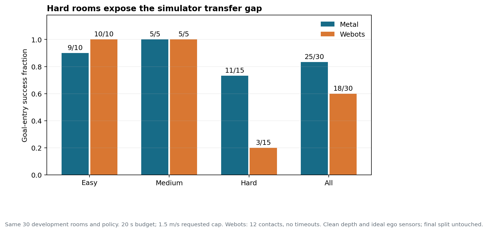

Inputs: [paired per-case CSV](../evidence/inputs/room-webots-transfer/cases.csv), [summary](../evidence/inputs/room-webots-transfer/summary.json), and [portable raw proof](../evidence/inputs/room-webots-transfer/proof.json). The proof includes actual episode receipts, exact worlds, controller logs and sparse traces. Late trace samples can precede contact by about one second, so their positions do not locate the contact precisely. Reproduce with `python3 webots/room_transfer.py`; the plot is generated by `evidence.py`.

---

## Moving-threat evidence

Kept deliberately separate from [long-route capability](#long-route-challenge-bank-capability): these are matched short-encounter tests against moving spheres, not route-planning tests.

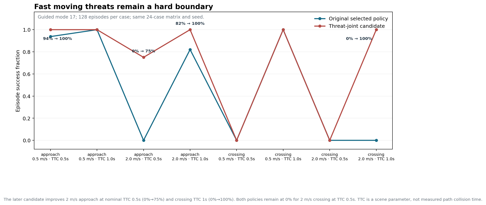

**The matched 24-case approach/crossing matrix, same scenes and seeds for both policies.** Threats are 0.35 m spheres; the vehicle starts at 1.5 m/s; TTC is the nominal straight-line encounter parameter, not the measured policy trajectory.

- Training moved **2 m/s crossings at 1 s nominal TTC from 0% → 100%**, and **2 m/s approaches at 0.5 s TTC from 0% → 75%**. The fastest crossings (2 m/s at 0.5 s) still fail.
- Inputs: [`evidence/inputs/threat-evaluation.csv`](../evidence/inputs/threat-evaluation.csv) (before), [`evidence/inputs/threat-joint-controlled.csv`](../evidence/inputs/threat-joint-controlled.csv) (after), guided mode 17 in both.
- Protocol and acceptance gaps: [BENCHMARKS · Disturbance curricula and controlled-threat acceptance gaps](BENCHMARKS.md#disturbance-curricula-and-controlled-threat-acceptance-gaps).

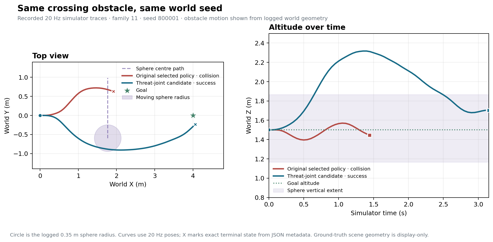

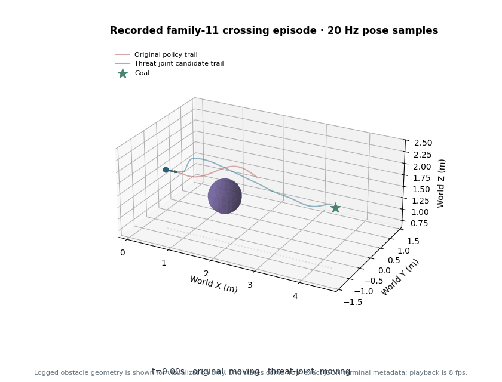

**Same family-11 scene, seed and moving obstacle for two policies.** The original policy collides; the later threat-joint candidate reaches the goal. The static projection uses 20 Hz pose rows and exact terminal JSON states. **The GIF renders recorded simulator logs and ground-truth obstacle motion for display — it is not camera footage and not a policy observation.**

- Inputs: [`evidence/inputs/early-crossing.json`](../evidence/inputs/early-crossing.json) + [`early-crossing.csv`](../evidence/inputs/early-crossing.csv) (original, collides), [`later-crossing.json`](../evidence/inputs/later-crossing.json) + [`later-crossing.csv`](../evidence/inputs/later-crossing.csv) (candidate, succeeds).
- Rendering contract (20 Hz pose paths, exact 100 Hz terminal state): [`artifacts/manifest.json`](../artifacts/manifest.json) → `visualization_trace_contract`.

**Reaction-time diagnostic (no figure):** `reaction-latency` clones a warmed episode, verifies matching motor outputs, then inserts an approaching sphere into one run and measures the first command/motor difference above 1e-4. Measured simulated upper bounds are 50 ms clean and 200 ms with 100 ms sensing plus 50 ms command delay, at 50 ms observation resolution. It excludes real sensor/transport timing and does not prove evasion success. Commands: [BENCHMARKS](BENCHMARKS.md#disturbance-curricula-and-controlled-threat-acceptance-gaps).

**Moving spheres in the general evaluation:** family 3 success is learned 98.4% vs geometry-only 94.5% vs goal script 72.7% at seed 800001 — see the next section.

---

## Policy quality, robustness and speed

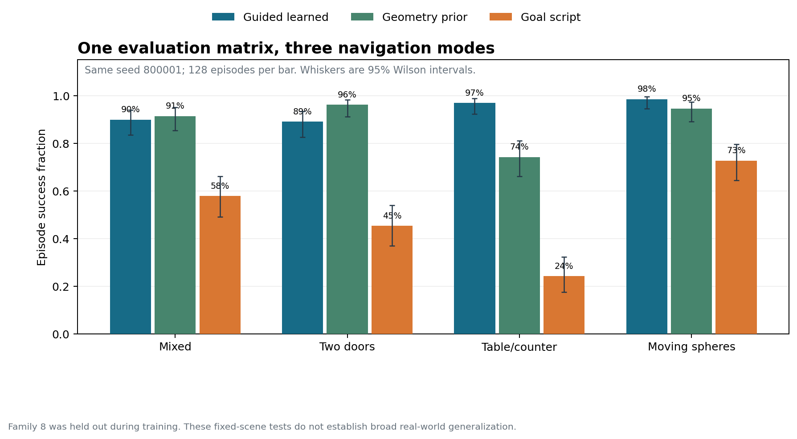

**Three inference modes on the same fixed static scene matrix, 28 configurations × 128 episodes at fixed command caps, seed 800001.** The geometry-only prior (mode 13) is reported beside the learned policy (mode 17) because it is a strong baseline and is not uniformly worse.

| Environment family | Learned (17) | Geometry-only (13) | Goal script (2) | Learned, fresh seed 900001 |
|---|---:|---:|---:|---:|
| Table / counter | **96.9%** | 74.2% | 24.2% | 98.4% |
| Moving spheres | **98.4%** | 94.5% | 72.7% | 92.2% |
| Mixed (families 0–6) | 89.8% | 91.4% | 57.8% | 91.4% |
| Held-out two-door composition | 89.1% | 96.1% | 45.3% | 92.2% |

Earlier standalone evidence that the policy uses actual perception: box world **81.25%** success vs 47.66% goal-script, **0%** random, 47.66% blind-depth ablation.

- Inputs: [`evidence/inputs/evaluation.csv`](../evidence/inputs/evaluation.csv); machine-readable inputs preserved with hashes.
- Protocol: [BENCHMARKS · Final deliverable evaluation](BENCHMARKS.md#final-deliverable-evaluation) and [Fresh-seed learning evidence](BENCHMARKS.md#fresh-seed-learning-evidence).

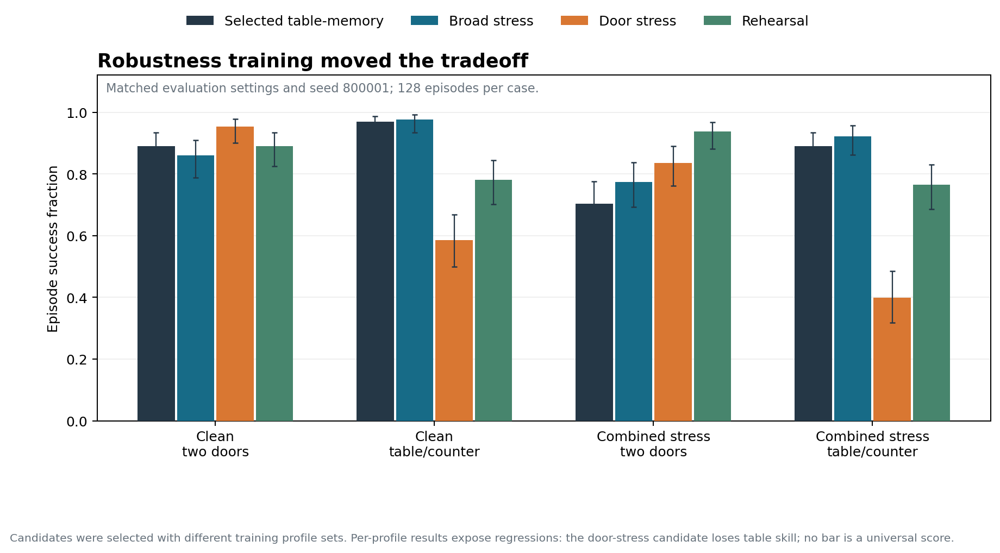

**Clean and combined-stress profiles shown together for every candidate, so a gain in one is never reported without the loss in the other.** Each candidate was trained under different conditions; this is a per-profile comparison, not a matched training trial.

- Combined stress = 100 ms sensor delay + 50 ms command delay + 0.05 m depth noise + 10% pixel dropout + 0.5 m/s² wind: held two-door success falls to **70.3%**.
- Single factors on held two-door, mode 17: 100 ms sensor delay 85.2%, 0.5 m/s² wind 84.4%, 0.05 m noise 88.3%, 10% dropout 87.5%, 50 ms command delay 76.6%.
- Inputs: [`evidence/inputs/evaluation.csv`](../evidence/inputs/evaluation.csv), [`evidence/inputs/continuation-evaluation.csv`](../evidence/inputs/continuation-evaluation.csv).
- Protocol: [BENCHMARKS · Final deliverable evaluation](BENCHMARKS.md#final-deliverable-evaluation).

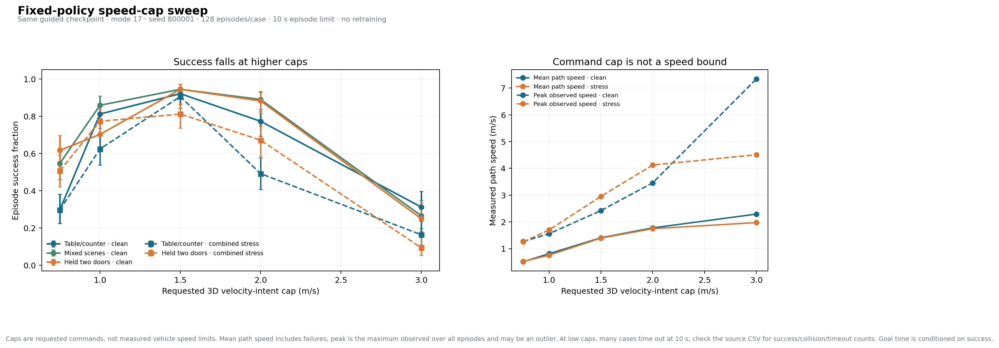

**The requested 3D velocity-intent cap swept on fixed weights — this changes the command, not the learned policy.** High success near 1.5 m/s on these static scenes, steep loss at 3 m/s, and timeouts at low caps under the 10-second limit. **The cap does not bound vehicle speed:** the measured maximum reaches 7.34 m/s in one table/counter case. This is an inference stress test, not a safe cruising speed and not a trained speed curriculum.

- Inputs: [`evidence/inputs/static-speed.csv`](../evidence/inputs/static-speed.csv), [`static-speed.log`](../evidence/inputs/static-speed.log).
- Reproduce: `python3 evaluation.py --speed-sweep`.
- Protocol: [BENCHMARKS · Fixed-policy command-cap sweep](BENCHMARKS.md#fixed-policy-command-cap-sweep).

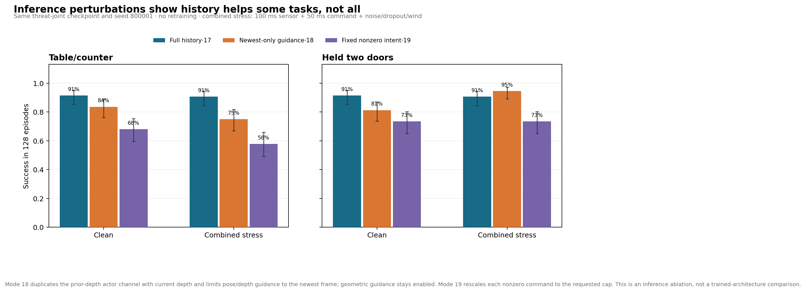

**Inference ablations on one fixed checkpoint — three modes, no retraining.** Mode 18 duplicates the prior-depth input with the current frame and limits geometry-memory guidance to the newest frame; mode 19 rescales nonzero navigation commands to the requested cap. The history effect varies by task and disturbance profile.

- Inputs: [`evidence/inputs/threat-joint-ablations.csv`](../evidence/inputs/threat-joint-ablations.csv), [`threat-joint-ablations.log`](../evidence/inputs/threat-joint-ablations.log).
- Reproduce: `python3 evaluation.py --ablations`.
- Protocol: [BENCHMARKS · Fixed-weight inference ablations](BENCHMARKS.md#fixed-weight-inference-ablations).

---

## Next phase

The user has accepted the obstacle-course milestone and asked for **longer varied courses, moving obstacles, narrow passages, some speed optimization, and a simpler evidence-rich README**. This page is that README's evidence side; their verified results and limits are recorded below as each mission completes.

Intent, in outcome terms:

1. **Longer varied courses** — extend the frozen bank's route difficulty (longer connected sequences, more offset/narrow doorways) while keeping the final split untouched and PPO as the control.
2. **Moving obstacles on real routes** — combine the moving-threat behaviour (which works in short encounters) with route-following tasks; today those two bodies of evidence are separate.
3. **Narrow passages** — attack the measured failure mode at choice points (grazing collision at corners and door choices), where a global clearance tax was already measured and rejected.
4. **Speed** — raise useful navigation speed without losing reliability, measured against the same success contracts rather than against the requested cap.
5. **Transfer** — diagnose the eight Metal successes that contacted in the completed Webots matrix. Separate sensing/startup differences from inadequate navigation margins before choosing training changes.

Nothing in this section is a result. When a mission finishes, its `report.md` and `handoff.json` land in its own `results/<mission>/` folder *(local)* and are published here only after verification.

---

## Native moving-obstacle course

The [reviewed Webots run](COURSE_BANK_REVIEW.md) uses the unchanged default policy and actual RAPTOR motors: 17.09 s to first goal entry, no contact, 12.22 m traveled, and altitude from 1.01 to 2.20 m. This is one selected DEV scene; it does not establish a reliability rate or stable arrival hold.

[Watch the actual native recording](../artifacts/videos/native-moving-course.mp4)

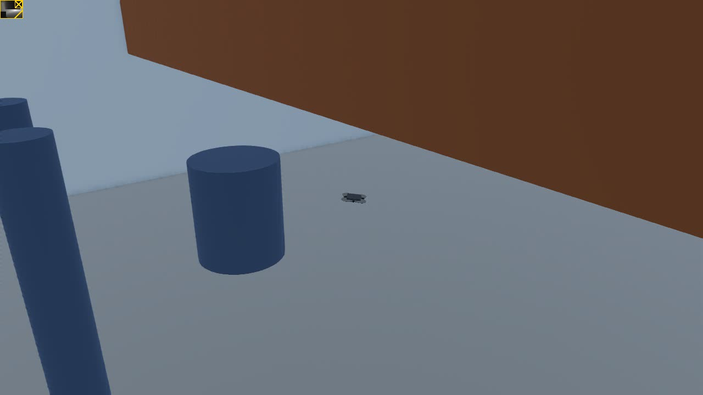

The new 324-record course bank exposes further failures: the selected room policy completes 10/108 DEV cases. Its 108/108 privileged witnesses used 60 s, versus the policy's 20 s, so that witness result cannot establish matched-budget feasibility. The review records mover timing and clearance limits.

---

## Corner training and observation audit

The [source-only imitation experiment](IMITATION_EXPERIMENT.md) reduced command loss but left corner DEV completion at 0/30 and lost existing room and vertical skills. Its candidates were rejected. A controlled TRAIN mirror probe found identical actor inputs at spawn despite opposite privileged route choices; later sensing can distinguish the worlds. Raw receipts, code and progression are public.

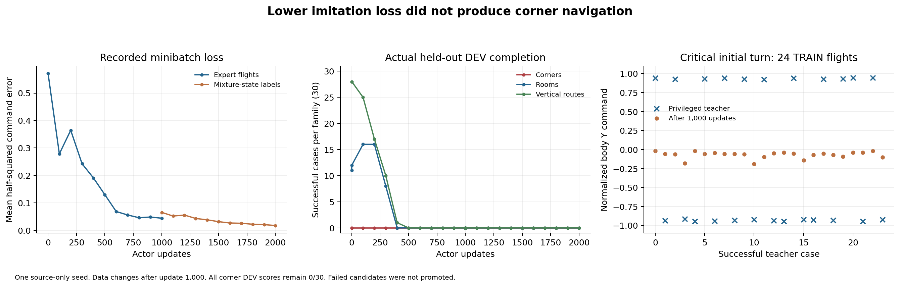

---

## Not included, on purpose

- **Blender reconstructions** of doorway and connected-room flights. They are rejected deliverables, not native footage, and are neither embedded nor promoted here. Their provenance record exists precisely so the distinction stays auditable: `evidence/inputs/flight-videos/manifest.json` *(local only)*.
- **Synthetic verifier fixtures** (`SYNTHETIC_FIXTURE_*.mp4`) — self-test inputs, never navigation evidence.
- **New plots generated for this page.** This gallery only catalogs figures that already exist and were produced by [`evidence.py`](../evidence.py) from hashed inputs. No figure was manufactured, regenerated or re-thresholded to make a claim look complete.
- **Any final-split result.** There is none; the final 90 levels have never been evaluated.
- **Hardware or airframe fidelity claims.** Numerical parity and simulator agreement are software checks.
