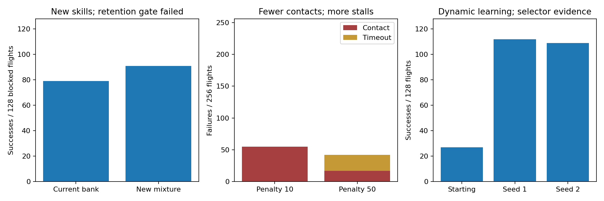

# Training changes teach useful skills, but still miss the full outcome

Three controlled source studies show different limits. Every study completed
both training seeds and kept failures. No policy from these comparisons is
adopted as the fast, reliable, robust navigator.

| Change | Measured gain | Failed requirement |
|---|---|---|
| Existing tasks versus a new local mixture; four 10,000-rollout arms | New blocked-task success 79→91/128 | Exposed DEV-c retention 196→184/256 violates the −3 floor |
| Collision cost 10 versus 50; four 5,000-rollout arms | Nonselector contacts 55→17/256; success 201→214/256 | Timeouts 0→25; successful arrival 3.03→5.07 s; open-space success 256→242 |
| Moving-threat training, with a previous-depth comparison; four 5,000-rollout arms | Development selector success rises from 27/128 to 112/128 and 109/128 at selected FULL checkpoints | Retention fails; cached geometry history survives the original ablation, so it does not test complete removal of depth history |



The larger collision penalty supports the operator's hypothesis: training
does reduce contacts when their cost rises. It also encourages caution that
sometimes becomes a stall. The task mixture teaches new detours while losing
some earlier skills. Dynamic avoidance is learned on the source development
tasks, but the role of past depth is not established by the original test.
These are distinct findings, not evidence that training in general fails.

The studies keep PPO and the existing 184-input navigation interface, frozen
RAPTOR controller and nominal source plant. Each comparison changes the
declared task mixture, collision cost, or observation-history condition.
Outside-view goals are legitimate training tasks; visibility is a measured
difficulty axis, not a universal task acceptance rule.

The next studies correct the depth-history comparison and test a larger
arrival reward with the same collision-cost controls. They are separate
predeclared experiments. Their results are excluded from this figure and
archive. Weighted rehearsal also requires independent sampler review before
new training. No declared gate is changed to make an earlier study pass.

The source results here do not prove dynamic Webots transfer or broad
disturbance robustness. The separate [256-flight native static comparison](NATIVE_BC_TRANSFER.md)
uses frozen learned weights without target training and shows a reliability
gain with slower arrivals. A fresh sealed FINAL remains future work after
the full system and selection procedure are frozen.

## Reproduce the result analysis

```sh
python3 training_strategy_review.py
python3 training_strategy_review.py --figure artifacts/plots/training-strategy-results.png
```

[The archive](../evidence/inputs/training-strategies/records.tar.gz) contains
246 hashed original evaluation, training-history and decision inputs.
The script verifies the hashes and flight denominators before recomputing
the tables. Plot generation additionally requires matplotlib. Dynamic rows
use selected checkpoints on the development selector; mixture and collision
rows use final checkpoints as declared. This is reproducible result analysis,
not a claim of complete training-build reproduction or hardware validation.
