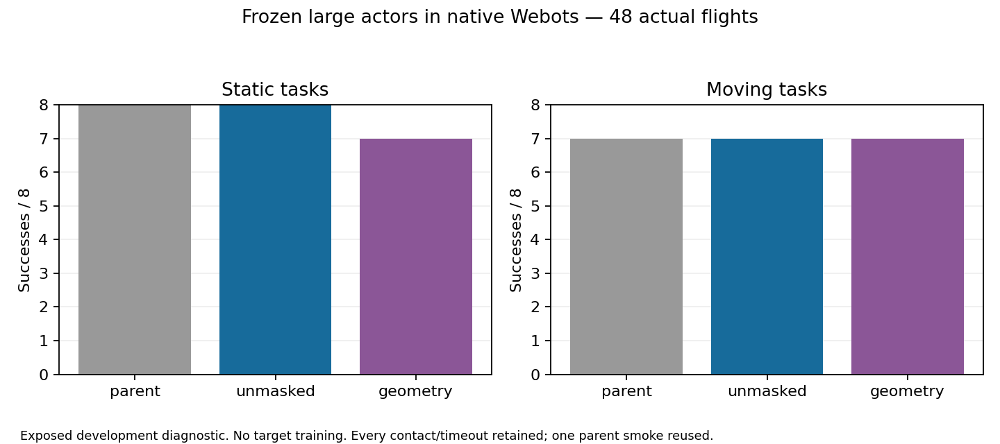

# Large policies in native Webots

The frozen 5,120-unit navigation actor now runs through Webots depth, ODE physics,
real RAPTOR and motors. In the completed 48-flight diagnostic, the composed
parent and prior physical-retention actor each reached 15 of 16 goals. No actor
weights or navigation behavior were trained on Webots.

The previous deployment loader accepted only the 64-unit guided actor. The new
NAVWID4 format records hidden width, weight count, body frame, timing, speed,
model camera contract and source provenance. It exports only the actor; the
critic and training teacher are absent. Existing NAV formats remain unchanged.

## Port verification

The [exporter](../navigation_export_wide.py) and
[CPU loader](../navigation_wide_deployment.hpp) passed these checks:

- Export preserves all 967,688 actor parameters. No layer or output is resized.
- On 512 input fixtures, the frozen Metal actor and CPU mean differ by at most
  0.00000144. The actual `sim_act` kernel's body commands agree within
  0.000000552, and normalized intents within 0.000000418.
- The existing 64-unit actor's means and commands match the new reader exactly.
- Eight malformed metadata, weight, truncation and trailing-byte cases are
  refused. The native controller compiles for arm64 and x86_64.

The CPU fixture measured 0.542 ms per forward on this Mac, averaged across two
forwards per input. That is a local inference measurement, not a microcontroller
latency, memory or flight guarantee. The FP32 actor occupies about 3.9 MB.

## Frozen independent flights

The fixed selection uses the first eight static DEV-b records and first eight
bounded-moving course records. Static cases cover poles, gaps, tables, bent
hallways, connected rooms and vertical choices. Three source-trained actors
each fly the same 16 records. The parent integration smoke is explicitly reused;
the batch performs 47 additional flights without filtering an outcome.

| Actor | Static success / contact / timeout | Moving success / contact / timeout |
|---|---:|---:|
| Composed parent | 8 / 0 / 0 | 7 / 1 / 0 |
| Prior physical retention | 8 / 0 / 0 | 7 / 1 / 0 |
| Geometry critic treatment | 7 / 0 / 1 | 7 / 1 / 0 |

The prior retention actor has no paired win or loss versus its parent; common
arrivals are 0.127 s sooner. The geometry actor adds one timeout. Its faster
common arrivals therefore do not establish a better policy.



Root verified all process exits, loaded actor/RAPTOR receipts, stable arrival
conditions, world hashes and mover telemetry. Actual mover positions match the
shared motion formula within 0.000935 m. Source and native outcome classes agree
on 44 of 48 paired runs. All three actors also collide on moving record 9 in
Metal, so that shared failure is not introduced solely by the port. The geometry
actor's extra native timeout remains in the comparison.

This is nominal, exposed development evidence, not a sealed final test or a
broad robustness claim. The established legacy observation adapter is preserved:
the model uses vertical half-tangent 0.75 and body-origin poses; the physical
native RangeFinder has 0.8 and a 0.08 m mount. That residual mismatch is disclosed,
and no target feedback was used to retune it.

All runs use the isolated RL project, port 23456, minimized batch mode, and no
movie recording. Webots documents `--no-rendering` as disabling the main 3-D
view; robot sensor rendering remains required. See the
[official startup options](https://www.cyberbotics.com/doc/guide/starting-webots).
Existing actual flight videos remain in the repository.

## Reproduce

```sh
python3 navigation_wide_native_results.py \
  --archive evidence/inputs/wide-native/records.tar.gz
```

This offline replay verifies 451 hashed inputs and the actual process, actor,
world, stable-arrival and mover receipts. It does not launch a simulator. Raw
worlds, trajectories, source comparison records, frozen actors, loader tests
and controller code are retained with every failed flight.
